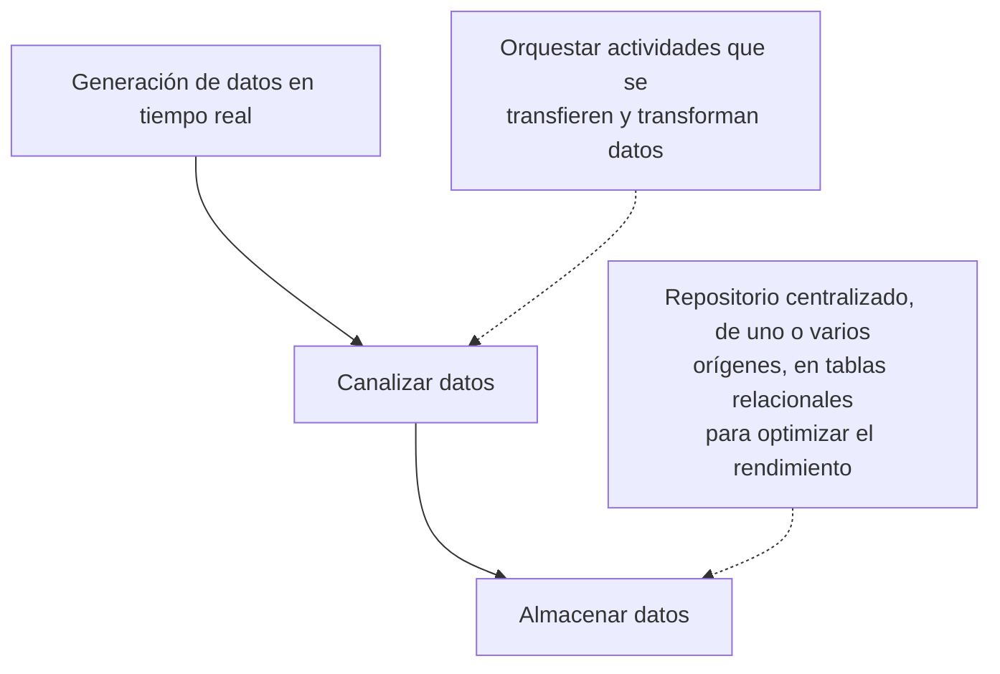

!!! warning

    Contenido transcrito automáticamente a partir de apuntes manuscritos. Puede
    contener errores de lectura y está pendiente de revisión.

## Rol del Data Engineer

El ingeniero de datos es responsable de integrar, transformar y consolidar datos tanto
estructurados como no estructurados, para crear soluciones analizables. Debe asegurarse
de crear pipelines y almacenamiento de datos de alto rendimiento, eficientes,
organizados y fiables.

## Tipos de datos

- **Semiestructurados**: no están organizados en un formato predefinido, pero contienen
  etiquetas u otros elementos para separar los elementos. Ejemplo: JSON. Este tipo de
  datos requiere ser procesado antes de cargarlo al sistema, ya sea extrayendo datos,
  convirtiendo formatos, etc.

## Operaciones con datos

- **Integración de datos**: consiste en ubicar la información a extraer para establecer
  enlaces con la aplicación o servicio a utilizar, con el fin de que sea seguro y
  fiable.
- **Consolidación de los datos**: combinar datos de múltiples orígenes para que tengan
  un mismo sentido (misma estructura coherente).

## Lenguajes utilizados

Otro lenguaje empleado en el ecosistema, además de SQL y Python: **Scala**.

## Datos operativos y datos analíticos

Los datos operativos son datos transaccionales generados y almacenados por aplicaciones
en una base de datos relacional (estructurada) o no relacional (no estructurada).

Los datos analíticos son datos que se han optimizado para el análisis e informes, a
menudo en un almacenamiento de datos.

Los datos operativos son los datos generados por una aplicación o servicio; por ejemplo,
una red de sensores que va recopilando datos y los transmite vía JSON o similar. El
trabajo del ingeniero de datos es extraer estos datos, realizar algún tipo de procesado
para obtener datos estructurados o compatibles con procesos posteriores, y cargarlos en
el sistema. Todo con la idea de convertir los datos operacionales en analíticos.

## Streaming de datos

La generación de datos en tiempo real (por ejemplo, IoT o redes sociales) genera la
necesidad de capturar flujos de datos en tiempo real e ingerirlos en sistemas de datos
analíticos, junto con datos operacionales procesados en lotes. El resultado son datos
heterogéneos.

## Apache Spark

Marco de procesamiento en paralelo que aprovecha el procesamiento en memoria y un
almacenamiento distribuido.

!!! note "Figura del original"

    Diagrama de arquitectura de Azure con cuatro etapas: **Datos operativos**
    (aplicaciones con iconos de SQL y otros orígenes; datos en tiempo real desde
    IoT), **Ingesta de datos: ELT** (Azure Synapse Analytics, Azure Stream
    Analytics, Azure Data Factory), **Almacenamiento y procesamiento de datos
    analíticos** (Azure Data Lake Storage Gen2, Azure Databricks) y **Modelado de
    datos y visualización** (Microsoft Power BI). Anotaciones manuscritas: Azure
    Synapse Analytics "proporciona funciones para canalización de datos,
    administrar datos analíticos en un lago de datos o un almacenamiento de datos
    relacional"; Azure Data Lake Storage Gen2 marcado como "Almacenamiento"; el
    conjunto se señala como idea de organización a tener en cuenta.

## Azure Data Lake Storage y Hadoop

Azure Data Lake Storage organiza los datos mediante una jerarquía de directorios,
accesible desde un explorador de archivos.

Azure Data Lake permite afrontar estos datos heterogéneos de gran volumen, posibilitando
soluciones en tiempo real y por lotes. Es compatible con Hadoop, un marco de trabajo
para almacenar y procesar de manera eficiente conjuntos de datos grandes. Permite la
creación de clústeres de varias computadoras para analizar conjuntos de datos en
paralelo y con mayor rapidez.

Hadoop está compuesto por cuatro módulos principales:

- **HDFS** (_Hadoop Distributed File System_): sistema de archivos que proporciona un
  mejor rendimiento, alta tolerancia a errores y compatibilidad nativa con datos de gran
  tamaño.
- **YARN** (_Yet Another Resource Negotiator_): administra y supervisa los nodos del
  clúster y el uso de recursos, y programa trabajos y tareas.
- **MapReduce**: marco que ayuda a los programas a realizar cálculo paralelo de los
  datos.
- **Hadoop Common**: proporciona bibliotecas para el uso en los diferentes módulos.

> Nota del autor: no tiene sentido continuar por esta vía del curso, ya que es contenido
> específico de Azure.

## Herramientas a utilizar o conocer

- **Apache Airflow**: orquestación de datos (ETL).
- **Apache Spark**: motor de análisis unificado para el procesamiento de Big Data.

### ¿Diferencia entre Apache Airflow y Spark?

Apache Spark es un sistema de computación distribuido que se utiliza para el
procesamiento y análisis de Big Data. Proporciona procesamiento en memoria y permite
manejar grandes conjuntos de datos a través de múltiples máquinas.

Apache Airflow es una plataforma de gestión de flujo de trabajo que permite al usuario
programar tareas, posibilitando gestionar pipelines de datos.

- **Kafka**: permite crear aplicaciones en tiempo real donde múltiples fuentes se unen o
  se introducen en un sistema.

## Contenido eliminado por estar ya en la wiki

| Tema eliminado                                                                       | Ya cubierto en                                                               |
| ------------------------------------------------------------------------------------ | ---------------------------------------------------------------------------- |
| Datos estructurados y no estructurados (definición y ejemplos)                       | `docs/07_artificial_intelligence/03_deep_learning/section_1_fundamentals.md` |
| ETL/ELT (transformación de datos)                                                    | `docs/05_infrastructure/02_cloud/section_1_fundamentals.md`                  |
| SQL como lenguaje de consulta y Python como lenguaje del ingeniero de datos          | `docs/05_infrastructure/01_databases/section_1_sql.md`                       |
| Concepto de lago de datos (datos en crudo, heterogéneos, escalables)                 | `docs/05_infrastructure/02_cloud/section_1_fundamentals.md`                  |
| Lagos de datos como almacenamiento basado en archivos para reducir coste/complejidad | `docs/05_infrastructure/02_cloud/section_2_aws.md`                           |
| Docker (crear contenedores) y Kubernetes (automatizar despliegue/escalado)           | `docs/06_operations/section_1_containers.md`                                 |
| SQL para bases de datos estructuradas y consultas                                    | `docs/05_infrastructure/01_databases/section_1_sql.md`                       |
| MongoDB/Cassandra como bases NoSQL y PostgreSQL/MySQL como bases SQL                 | `docs/05_infrastructure/01_databases/section_1_sql.md`                       |
| Proveedores de nube (GCP, Azure, AWS)                                                | `docs/05_infrastructure/02_cloud/section_1_fundamentals.md`                  |

## Procedencia

Cursos/Data Engineer/Apuntes.pdf, páginas 1 a 4. Contenido podado por solapamiento con
la wiki publicada; ver tabla anterior.
