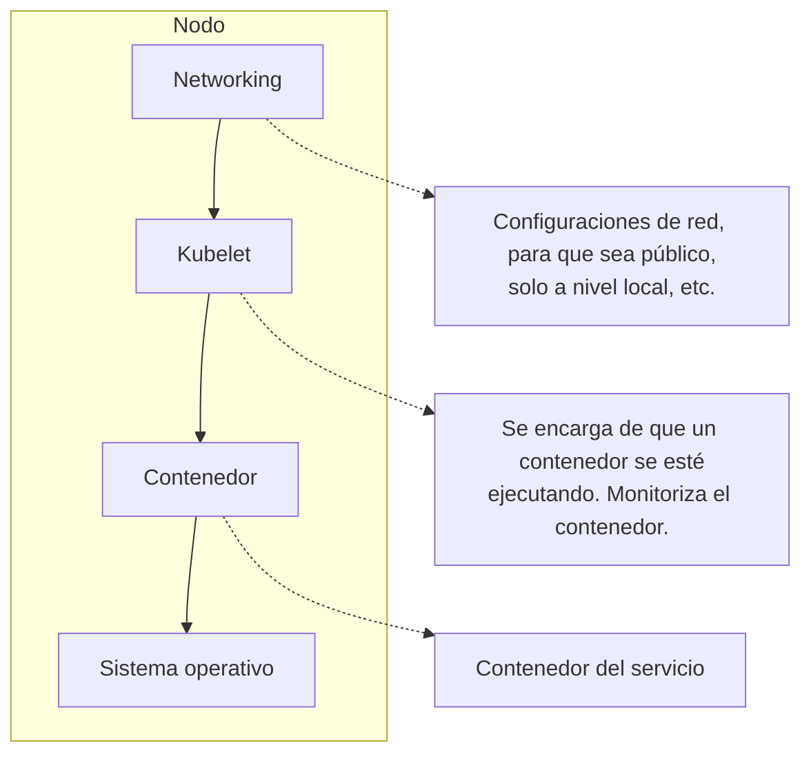
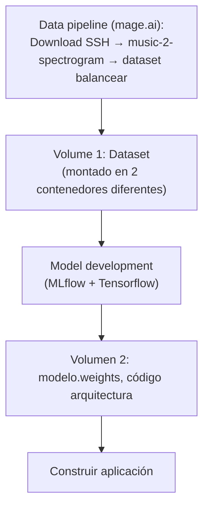
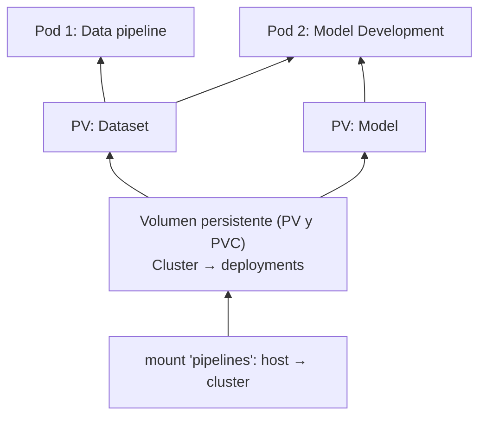

!!! warning

    Contenido transcrito automáticamente a partir de apuntes manuscritos. Puede
    contener errores de lectura y está pendiente de revisión.

## Introducción a DevOps

**DevOps** = _Development_ + _Operations_.

- El equipo de desarrollo se encarga de la creación del producto.
- El equipo de infraestructura/operaciones se encarga de la puesta en producción.

Esta separación genera problemas, sobre todo porque cada equipo tiene sus propios
requisitos y objetivos:

- Aislamiento de equipos.
- Fricción entre equipos.
- Baja automatización.

DevOps es un conjunto de buenas prácticas que utiliza herramientas para la
automatización de procesos. Al final, se trata de facilitar la vida del desarrollo.

Las empresas tienen releases fijos para los despliegues, y DevOps permite ayudar con
este tipo de ineficiencias, buscando el alineamiento de la compañía y entregar valor
continuamente. Esto se traduce en:

- Mayor satisfacción del cliente, al tener productos con mayor calidad.
- Mayor agilidad.

Como aspectos clave de DevOps tenemos:

- **Control de versiones**: git, svn, por ejemplo GitHub, GitLab, etc. (repositorio de
  código centralizado).
- **Integración continua** y **entrega continua** (conceptos relacionados entre sí):
    - Integración continua: pipelines con Jenkins que automatizan compilaciones y
      pruebas cuando se hace un commit.
    - Entrega continua: suministrar el software rápido y confiable en cualquier momento.
- **Infraestructura como código**: Terraform, definición declarativa de la
  infraestructura mediante archivos de definición basados en texto, para revertir,
  desmontar y recrear entornos.
- **Supervisión y registro**: Prometheus, Grafana; monitorización, recopilar métricas,
  etc.
- **Aprendizaje validado**: medir mediante KPIs el ROI de las herramientas de
  automatización, con el fin de seguir mejorando los procesos.

Estos pipelines se suelen combinar con herramientas de mensajería para alertar sobre
incidencias, por ejemplo Slack.

El responsable de implementar estas prácticas, herramientas y demás es el **Site
Reliability Engineer (SRE)**.

## Docker

### Rotación de logs

Como recomendación sería bueno ajustar la configuración de los logs de los contenedores.

Rotación de los logs:

```bash
sudo nano /etc/docker/daemon.json
```

!!! note "Figura del original"

    Captura de terminal (tema oscuro) mostrando un fragmento del fichero de
    configuración `daemon.json`, con anotaciones manuscritas indicando el
    significado de cada parámetro:

    ```json
    "log-driver": "json-file",
    "log-opts": {
        "max-size": "10m",
        "max-file": "3"
    }
    ```

    Anotaciones manuscritas: `max-size` → tamaño máximo de los ficheros de log;
    `max-file` → cada vez que tengamos 3 archivos, se eliminan.

### Primeros pasos con Docker

Todo lo que tiene una interfaz gráfica no es buena práctica meterlo en un contenedor de
Docker.

- La versión gratuita de DockerHub permite crear repositorios públicos ilimitados y 1
  privado.

### Docker Compose

- `restart: always` → parámetro de Docker Compose que indica que el contenedor debe
  reiniciarse automáticamente siempre que se detenga, ya sea debido a un error o cuando
  el sistema Docker se reinicia.
- **Configuración rootless**: permite ejecutar un daemon de Docker y contenedores como
  un usuario no root, para mitigar posibles vulnerabilidades.
- Los `ARG` son argumentos que podemos declarar en un Dockerfile y que permiten
  especificarlos cuando se ejecuta un build.

### Límite de recursos por contenedor

Para limitar los recursos utilizados por un contenedor modificamos el fichero
`docker-compose.yml` creando un nuevo parámetro:

```yaml
services:
    data-pipeline:
        build:
            # ...
        ports:
            # ...
        volumes:
            # ...
        deploy:
            resources:
                limits:
                    cpus: "0.15" # 15 % de la CPU del host
                    memory: 250M # MB de memoria RAM del host
                reservations:
                    cpus: "0.1" # recursos que reserva, que han de ser menores
                    memory: 128M # que el límite especificado
```

### Redes en Docker Compose

Definir segmentos de red para los contenedores:

!!! note "Figura del original"

    Captura de un editor (tema oscuro) mostrando la sección `networks` de un
    fichero `docker-compose.yml`, con anotaciones manuscritas sobre cada campo:

    ```yaml
    networks:
        env_prod: # para producción
            driver: bridge # tipo de driver
            #activate ipv6 # activar IPv6
            driver_opts:
                com.docker.network.enable_ipv6: "true"
            #IP Adress Manager
            ipam:
                driver: default
                config:
                    - subnet: 172.16.232.0/24 # IPv4
                      gateway: 172.16.232.1
                    - subnet: "2001:3974:3979::/64" # IPv6
                      gateway: "2001:3974:3979::1"

        env_prep: # para desarrollo
            driver: bridge
            #activate ipv6
            driver_opts:
                com.docker.network.enable_ipv6: "true"
            #IP Adress Manager
            ipam:
                driver: default
                config:
                    - subnet: 172.16.235.0/24
                      gateway: 172.16.235.1
                    - subnet: "2001:3984:3989::/64"
                      gateway: "2001:3984:3989::1"
    ```

Anotación manuscrita junto a la captura, sobre el mismo `docker-compose.yml`, para
utilizar la configuración de red en un contenedor:

```yaml
services:
    data-pipeline:
        build:
            # ...
        networks:
            - env_prod # para utilizar la configuración de la red en un contenedor
        ports:
            # ...
```

## Kubernetes

### Arquitectura y componentes

Existen diferentes tipos o maneras de escalar un sistema:

- De forma vertical: aumentar CPU, GPU o memoria de un nodo/servidor.
- De forma horizontal: aumentar el número de nodos/servidores → conforman un
  **cluster**. Este es más eficiente, y Kubernetes facilita mucho este tipo de escalado.

Existen nodos _workers_ y maestros. Los nodos maestros se destinan a las tareas que se
encargan de la propia gestión del cluster, mientras que los _workers_ se encargan de
ejecutar las tareas relacionadas con la aplicación. Por defecto suele haber 1 nodo
maestro y 1 nodo _worker_.

Existen 4 componentes esenciales de Kubernetes:

- **etcd**: almacena todo lo que se define en Kubernetes, configuración, estados, etc.
  Es una base de datos clave-valor distribuida y de alta disponibilidad.
- **Scheduler**: proceso del plano de control que asigna Pods a los nodos. Selecciona
  nodos óptimos y filtra los nodos que no cumplen con las necesidades de un Pod, etc.
- **API Server**: interfaz para manejar, desarrollar y configurar los clústeres de
  Kubernetes.
- **Controller Manager**: es un daemon que incorpora los bucles de control principales
  enviados con Kubernetes.



### Tipos de clúster y minikube

Existen 2 tipos de clústeres:

- **On-premise**: la propia empresa monta su infraestructura a nivel local.
- **Gestionados**: proporcionados por proveedores de nubes públicas, AWS, Azure, GCP,
  etc.

A su vez, los On-premise pueden ser:

- **All in one**: se instala todo en un único nodo usando minikube, para propósito de
  aprender/pruebas.
- **Single master and multiworker**: un nodo para el panel de control y otro o más para
  ser controlados por el master.
- **Single master, single etcd and multiworker**.
- **Multi master y multiworker**: alta disponibilidad.

Minikube crea un cluster levantado con Docker, como un contenedor.

```bash
minikube dashboard --url
```

Permite abrir el dashboard de Kubernetes.

```bash
kubectl get pods
```

Obtener los pods creados.

```bash
kubectl describe pod nombre-del-pod
```

Permite obtener más información del pod.

```bash
kubectl expose pod nombre-del-pod --type=LoadBalancer --port=8080 --target-port=80
```

Permite exponer un pod como servicio de tipo `LoadBalancer`, mapeando el puerto 8080 del
host al puerto 80 del pod.

```bash
kubectl get services
```

Permite devolver una lista de los servicios creados.

```bash
kubectl describe service nombre-del-servicio
```

Obtiene una descripción del servicio, como la IP, puerto, etc.

```bash
minikube service --url nombre-del-servicio
```

Hace que minikube devuelva la URL del servicio para acceder a él.

### Ejemplo: pipeline de datos y modelos con volúmenes persistentes





## Git

- **Fork**: duplica el repositorio y su historial.

Criterios adicionales para elegir estrategia de ramificación, no recogidos en la wiki:

- **Trunk based** resulta más adecuado cuando el equipo de desarrollo tiene perfiles más
  senior y sigue un enfoque TDD.
- **Gitflow** resulta más adecuado para proyectos open source, con alto número de
  programadores junior, alta rotación de equipo, o sobre un producto ya existente.

## Jenkins

Jenkins permite establecer un conjunto de tareas para detectar cuando en el repositorio
se ha producido algún cambio.

Podemos instalar Jenkins en Docker. Pide una clave:

```bash
docker logs nombre-contenedor-jenkins
```

En el log aparecerá la clave.

Dentro de Jenkins (pipeline) tenemos:

!!! note "Figura del original"

    Diagrama del concepto de pipeline de Jenkins. Un `Trigger` inicia el pipeline
    dada una condición (anotación manuscrita: "iniciar el pipeline dada una
    condición"). El pipeline contiene dos `Stage` (`Stage 1`, `Stage 2`), cada una
    asociada a un `Agent` y un `Job`. Dentro del pipeline se ejecutan `Step`, que a
    su vez contienen `Task` y `Script`. El resultado final del pipeline es la
    `Delivery`.

Un pipeline básico de Jenkins podría ser:

1. Hacer un pull de un repo.
2. Compilar la aplicación.
3. Instalarlo.

Los pasos 1 y 2 forman parte de CI/CD.

## Contenido eliminado por estar ya en la wiki

| Tema eliminado                                                                                 | Ya cubierto en                                       |
| ---------------------------------------------------------------------------------------------- | ---------------------------------------------------- |
| Componentes de Docker (Docker engine, Docker CLI, Docker Compose, containerd.io)               | `docs/06_operations/section_1_containers.md`         |
| Docker registry y planes de DockerHub, `hub.docker.com/repositories/`                          | `docs/06_operations/section_1_containers.md`         |
| Concepto de imagen base                                                                        | `docs/06_operations/section_1_containers.md`         |
| `docker logs nombre_contenedor` (uso básico)                                                   | `docs/06_operations/section_1_containers.md`         |
| `docker tag` y flujo `docker login` + `docker push` para publicar en DockerHub                 | `docs/06_operations/section_1_containers.md`         |
| `version` de `docker-compose.yml` y su deprecación                                             | `docs/06_operations/section_1_containers.md`         |
| Docker Swarm como orquestador y `docker stats` (uso básico)                                    | `docs/06_operations/section_1_containers.md`         |
| Kubernetes gestiona el ciclo de vida de los contenedores (crear, iniciar, detener, escalar)    | `docs/06_operations/section_3_orchestrators.md`      |
| Un mismo clúster de Kubernetes puede gestionar múltiples aplicaciones y servicios              | `docs/06_operations/section_3_orchestrators.md`      |
| Todo en Kubernetes es un objeto definido en `.yaml`, guardado en etcd y enviado vía API Server | `docs/06_operations/section_3_orchestrators.md`      |
| Concepto de rama (`branch`) y comandos `git branch`/`git checkout`                             | `docs/02_dev_tools/01_git/section_1_fundamentals.md` |
| Ventajas/inconvenientes generales de Trunk-Based Development y Gitflow                         | `docs/02_dev_tools/01_git/section_1_fundamentals.md` |
| Definición de "Trunk" como línea base del repositorio (rama principal)                         | `docs/02_dev_tools/01_git/section_1_fundamentals.md` |

## Procedencia

PDF de origen: `Cursos/DevOps Curso/Apuntes DevOps.pdf` (dentro de `notas_ml.zip`).
Páginas cubiertas: 1-9. Documento podado tras comparación con la wiki publicada en
`docs/06_operations/` (Docker, Kubernetes, CI/CD) y `docs/02_dev_tools/01_git/` (Git);
se conserva únicamente el contenido no cubierto por esas páginas.
