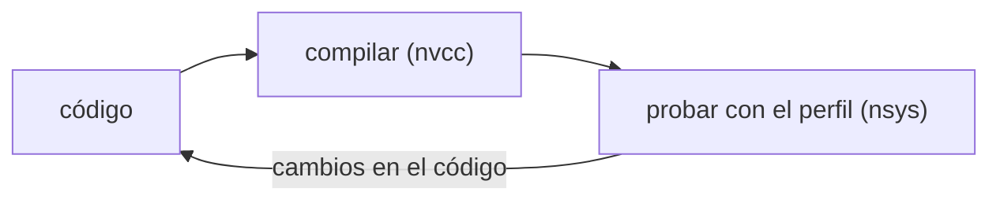

!!! warning

    Contenido transcrito automáticamente a partir de apuntes manuscritos. Puede
    contener errores de lectura y está pendiente de revisión.

Apuntes tomados por Manuel Ujaldón (`ujaldon@uma.es`) en las clases del 1/10/2022 y del
8/10/22.

## Multiplicación de matrices

Nota de vocabulario: _Save and checkpoint_ → guardar el estado anterior del programa.

## Ejercicio: acelerar una aplicación de conductividad térmica

Para una matriz $n \times m$ con fila $\rightarrow$ columna:

$$
\text{fila} = nj = 100 \qquad \text{columna} = ni = 200 \qquad \Rightarrow \qquad
20\,000 \text{ elementos}
$$

Si el tamaño de la malla es $(1, 1, 1)$, en ese espacio el máximo son 1024 hebras
(boceto de ejes $x = 1$, $y = 1$, $z = 1$).

Por lo tanto, máximo 1024 hebras, donde se reparten $x = 32$ hebras, $y = 32$ hebras
($\sqrt{1024} = 32$):

$$
32 \cdot 32 = 1024
$$

Como para $nj$ queremos mínimo 100 hebras, para obtener múltiplos de 32 (warp) el mínimo
son $32 \cdot 4 = 128$ hebras. Para $ni$ queremos 200 hebras mínimo, $32 \cdot 7 =
224$
hebras.

$$
\text{malla} (1, 1, 1) \qquad \text{num-hebras-bloque} (128, 224, 1)
$$

$$
128 \cdot 224 \cdot 1 = 28\,672 > 1024 \;!!
$$

Reorganizando ($128 / 32 = 4$, $224 / 32 = 7$):

$$
\text{malla} (4, 7, 1) \qquad \text{num-hebras-bloque} (32, 32, 1)
$$

## Ejercicio: addVectorsInto

Notas del 8/10/22:

a. `addVectorsInto(...)`. b. `[ilegible]` = 1, pero el profiler lo hace `[ilegible]`
veces. c. $2\,279\,534\,222$ ns.

## Módulo 2: Nsight Systems y memoria unificada

NVIDIA recomienda el ciclo APOD (_Assess, Parallelize, Optimize, Deploy_) para aplicar
mejoras de manera incremental.

`nsys` ejecutará la aplicación múltiples veces mostrando información de la GPU y también
actividad de la memoria unificada.

A la hora de usar `nsys` se trata de realizar un proceso reiterativo:

`nsys` devuelve un report `qdrep` que puede ser abierto en el programa de Nsight
Systems.

## Ejercicio 2, módulo 2

$$
2 \ll 24 = 2^{25} = 33\,554\,432
$$

$$
2^{25} = 2^{10} \cdot 2^{10} \cdot 2^{5}, \qquad 2^{10} \cdot 2^{10} = 1024, \qquad
2^{10} \cdot 2^{5} = 2^{15}
$$

Mejora el rendimiento cuando elegimos tamaños de malla con un tamaño de bloque que es
múltiplo del número de SM de una GPU.

## Ejercicio 5, módulo 2

$$
2^{12} = 4096 \text{ partículas} \qquad\qquad 2^{16} = 65\,536 \text{ partículas}
$$

## Contenido eliminado por estar ya en la wiki

| Tema eliminado                                                                                                                                                                                                      | Ya cubierto en                                                                                                      |
| ------------------------------------------------------------------------------------------------------------------------------------------------------------------------------------------------------------------- | ------------------------------------------------------------------------------------------------------------------- |
| Cálculo de configuración de hebras/bloques para la multiplicación de matrices 64×64 ("Accelerate 2D Matrix Multiply Application": `dim3`, diagrama de malla 2×2 de bloques de 32×32, requisito de más de un bloque) | `docs/03_programming/03_cuda/section_2_cuda_c.md` (sección "Multiplicación de matrices 2D")                         |
| Objetivos generales del módulo sobre `nsys`, SM, memoria unificada, fallos de página y precarga de memoria                                                                                                          | `docs/03_programming/03_cuda/section_2_cuda_c.md` (secciones "Asignación de memoria" y "Perfilado de aplicaciones") |
| Código para consultar las propiedades de la GPU (`cudaGetDevice`, `cudaDeviceProp`, `cudaGetDeviceProperties`)                                                                                                      | `docs/03_programming/03_cuda/section_2_cuda_c.md` (sección "Conceptos básicos")                                     |
| Cálculo del número de bloques para $N = 2^{25}$ elementos con máximo de hilos por bloque ($2^{25}/1024 = 32\,768$) y sintaxis de lanzamiento del kernel                                                             | `docs/03_programming/03_cuda/section_2_cuda_c.md` (consejo "Optimización de la configuración de ejecución")         |
| Precarga de memoria asíncrona con `cudaMemPrefetchAsync()` hacia GPU y hacia CPU                                                                                                                                    | `docs/03_programming/03_cuda/section_2_cuda_c.md` (sección "Precarga de memoria")                                   |
| Definición de SM (_streaming multiprocessors_) y de warp como grupo de 32 hebras                                                                                                                                    | `docs/03_programming/03_cuda/section_1_fundamentals.md` (sección "Warps")                                           |

## Procedencia

Contenido transcrito a partir de `Cursos/DLI/Clases.pdf` (dentro de `notas_ml.zip`),
páginas 1 a 10. Documento podado: se ha eliminado el contenido ya cubierto por la wiki
publicada en `docs/03_programming/03_cuda/`; ver la tabla anterior para el detalle de lo
retirado.
