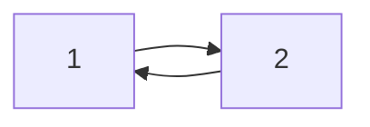
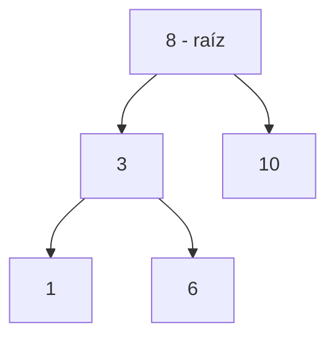
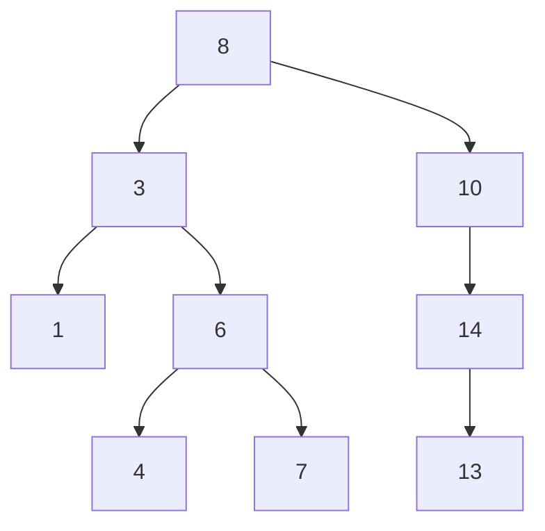

!!! warning

    Contenido transcrito automáticamente a partir de apuntes manuscritos. Puede
    contener errores de lectura y está pendiente de revisión.

## Estrategia de resolución de problemas y búsqueda binaria

### Estrategia general

Antes de resolver un problema conviene definir una estrategia:

1. Plantear el problema con claridad, identificando el formato de entrada y de salida.
2. Establecer algunos ejemplos de entrada y salida, y tener o probar todos los casos
   extremos.
3. Llegar a una posible solución, implementarla y probarla, corrigiendo los errores que
   surjan.
4. Analizar la complejidad del algoritmo e identificar ineficiencias.

### Problema de ejemplo: localizar una carta

!!! note "Figura del original"

    Captura de un enunciado de ejercicio, acompañada de un dibujo de siete cartas boca
    abajo marcadas con "?":

    QUESTION 1: Alice has some cards with numbers written on them. She arranges the
    cards in decreasing order, and lays them out face down in a sequence on a table.
    She challenges Bob to pick out the card containing a given number by turning over
    as few cards as possible. Write a function to help Bob locate the card.

Alice dispone de las cartas `[5, 8, 3, 9, 1, 4, 28]` y las ordena de mayor a menor,
obteniendo `[28, 9, 8, 5, 4, 3, 1]`.

Planteamiento:

1. Coger la carta de la mitad: `[28, 9, 8, [5], 4, 3, 1]` (índices 0 a 6). Lo que se
   consigue con esto es reducir la cantidad de números a explorar, quedándose siempre
   con la mitad.
2. Imaginando que Bob quiere encontrar el 9, se puede ir tomando cada vez la mitad del
   array resultante:

```python
high = 0
low = len(lista) - 1

while low >= high:
    mid = (high + low) // 2

    if lista[mid] > query:
        high = mid + 1
    elif lista[mid] < query:
        low = mid - 1
    else:
        return mid
```

En el caso de la búsqueda binaria, la longitud del tramo explorado se reduce a la mitad
en cada iteración:

$$
\text{longitud inicial} = N, \quad \text{iteración } k: \frac{N}{2^k}
$$

La longitud final del array será de 1, por lo que:

$$
\frac{N}{2^k} = 1 \;\Rightarrow\; N = 2^k \;\Rightarrow\; k = \log_2 N
$$

Complejidad resultante: $O(\log_2 N)$.

## Ordenación y búsqueda

### Ordenación de burbuja

Si los elementos ya están ordenados, la complejidad es lineal, $O(N)$. Hay que realizar
al menos $\frac{n \cdot (n-1)}{2}$ operaciones (fórmula de la serie aritmética).

### Búsqueda binaria

El original agrupa bajo el título "Ordenación por inserción" las dos funciones
siguientes, que en realidad ordenan la lista y después realizan una búsqueda binaria
sobre ella. La función `buscar` queda incompleta en el original (la rama `else` no
devuelve ningún valor):

```python
def ordenar(lista):
    if len(lista) > 1:
        for i in range(1, len(lista)):
            j = i

            while j > 0 and lista[j - 1] > lista[j]:
                temp = lista[j - 1]
                lista[j - 1] = lista[j]
                lista[j] = temp
                j -= 1


def buscar(lista, valor_buscar):
    lista = ordenar(lista)

    for i in range(len(lista)):
        punto_medio = len(lista) // 2

        if valor_buscar > lista[punto_medio]:
            i = [punto_medio, len(lista)]
        elif valor_buscar < lista[punto_medio]:
            i = [0, punto_medio]
        else:
            return
```

## Pilas, colas y listas enlazadas

### Colas

El original dibuja dos esquemas: una fila de casillas vacías con una flecha en la
esquina inferior izquierda que señala la extracción por el frente, y un array de ejemplo
con los índices 0, 1 y 2 sobre las casillas, con flechas que señalan hacia las
posiciones que contienen los valores 2 y 3, probablemente indicando el frente y el final
de la cola[?]:

| Índice | 0   | 1   | 2   |
| ------ | --- | --- | --- |
| Valor  | 1   | 2   | 3   |

### Listas circulares simples

Se trata de una lista en la que cada nodo tiene un enlace, similar al de las listas
enlazadas simples, excepto que el siguiente nodo del último apunta al primero. Como en
una lista enlazada simple, los nuevos nodos solo pueden ser insertados eficientemente
después de uno que ya tengamos referenciado.



## Árboles binarios

El original enuncia la regla de inserción como: los datos menores o iguales que la raíz
van al subconjunto izquierdo, y los mayores al derecho (empleando "menor o igual",
frente al criterio de estricta minoría que usa la wiki para el subárbol izquierdo).



En este ejemplo, el subárbol izquierdo está formado por los nodos 3, 1 y 6, y el
subárbol derecho por el nodo 10.

Si se quieren insertar los elementos `[8, 10, 3, 14, 13, 1, 6, 4, 7]` (tomando el 8 como
valor inicial y siguiendo la regla anterior en cada inserción), el árbol binario
resultante es el siguiente:



### Recorridos de un árbol binario

Sobre el árbol anterior, con la lista de inserción `[8, 10, 3, 14, 13, 1, 6, 4, 7]`, los
tres recorridos en profundidad producen:

- **En orden**: `[1, 3, 4, 6, 7, 8, 10, 13, 14]`.
- **Pre orden**: `[8, 3, 1, 6, 4, 7, 10, 14, 13]`.
- **Pos orden**: `[1, 4, 7, 6, 3, 13, 14, 10, 8]`.

El original redibuja el mismo árbol anotando junto a cada nodo, con números en rojo, la
posición que ese nodo ocupa dentro de la secuencia en orden (por ejemplo, el nodo 1
lleva el número 1, el nodo 3 el número 2, el nodo 8 el número 6, y así sucesivamente).

## Tablas hash

Una tabla hash es una manera de almacenar información de forma óptima y accesible de
forma rápida. La complejidad de acceso es $O(1)$ en vez de $O(N)$ para una búsqueda
lineal.

La tabla hash reduce el tiempo de búsqueda, localizando el dato en la casilla exacta
donde se encuentra. Para ello, la función hash toma la clave y la transforma en un
índice: $\text{Index} = \text{hash} \bmod N$. En el esquema del original, la clave
`marcos` con valor `7489` se pasa por una función $F(x)$ (la función hash) que produce
un índice dentro de un array de tamaño $N$.

Puede existir colisión: diferentes pares de clave-valor pueden tener el mismo índice.
Una opción es buscar la siguiente casilla vacía, con complejidad $O(N)$ en el peor caso,
ya que puede darse el caso de recorrer toda la lista sin encontrar hueco. Otra opción es
encadenar los elementos colisionados mediante listas enlazadas por índice, también con
complejidad $O(N)$ para recorrer la cadena.

Otra alternativa es cambiar la complejidad de la propia función hash: por ejemplo, si
una clave es una cadena de texto, se pueden obtener los valores ASCII de cada letra y
multiplicarlos por la posición que ocupa el carácter.

!!! note "Figura del original"

    Tabla que ilustra esta función hash basada en valores ASCII multiplicados por la
    posición del carácter, para las claves "marcos" y "socram":

    | Carácter          | m     | a    | r     | c    | o     | s     |
    | ----------------- | ----- | ---- | ----- | ---- | ----- | ----- |
    | ASCII × posición  | 109×1 | 97×2 | 114×3 | 99×4 | 111×5 | 115×6 |

    Suma total: 2286; índice = 2286 mod 10 = 6.

    | Carácter          | s     | o     | c    | r     | a    | m     |
    | ----------------- | ----- | ----- | ---- | ----- | ---- | ----- |
    | ASCII × posición  | 115×1 | 111×2 | 99×3 | 114×4 | 97×5 | 109×6 |

    Suma total: 2229; índice = 2229 mod 10 = 9.

## Preguntas de entrevista técnica

### Two Sum

!!! note "Figura del original"

    Given an array of integers, return indices of the two numbers such that they add
    up to a specific target. You may assume that each input would have exactly one
    solution, and you may not use the same element twice.

    Example: Given nums = [2, 7, 11, 15], target = 9, because nums[0] + nums[1] =
    2 + 7 = 9, return [0, 1].

Solución por fuerza bruta, $O(N^2)$:

```python
for i in range(len(lista)):
    for j in range(i, len(lista)):
        if lista[i] + lista[j] == target:
            return i, j
```

Solución con mapa hash: dado `target - value_1 = value_2`, se comprueba si `value_2`
está en la lista. Si no está, se guarda en el diccionario (`hashmap`); si está, se
consulta el diccionario y se devuelven los índices.

```python
diccionario = {}  # value: index
```

Complejidad en tiempo: $O(N)$. Complejidad en espacio: $O(N)$, por el uso del mapa hash.

### Compra y venta óptima de una acción

!!! note "Figura del original"

    Say you have an array for which the ith element is the price of a given stock on
    day i. If you were only permitted to complete at most one transaction (i.e., buy
    one and sell one share of the stock), design an algorithm to find the maximum
    profit. Note that you cannot sell a stock before you buy one.

    Example 1: Input: [7, 1, 5, 3, 6, 4], Output: 5. Explanation: Buy on day 2
    (price = 1) and sell on day 5 (price = 6), profit = 6 - 1 = 5. Not 7 - 1 = 6, as
    selling price needs to be larger than buying price.

Solución por fuerza bruta:

```python
tupla = ()

for i, val_i in enumerate(lista):
    max = 0

    for j, val_j in enumerate(lista[i:]):
        dif = val_j - val_i

        if dif > max:
            max = dif
            tupla = (i, j)

return max, tupla
```

Solución de una sola pasada, con la lista de ejemplo `[7, 1, 5, 3, 6, 4]`:

```python
max = 0  # tupla_max = (idx, value)
min = 9  # tupla_min = (idx, value)

for i, value in enumerate(lista):
    if value < min:  # O(N)
        min = value
        i_min = i

    if value > max and i_max > i_min:
        max = value
        i_max = i
```

### Detección de duplicados

!!! note "Figura del original"

    Given an integer array nums, return true if any value appears at least twice in
    the array, and return false if every element is distinct.

    Example 1: Input: nums = [1, 2, 3, 1], Output: true.
    Example 2: Input: nums = [1, 2, 3, 4], Output: false.
    Example 3: Input: nums = [1, 1, 1, 3, 3, 4, 3, 2, 4, 2], Output: true.

Solución por fuerza bruta, tiempo $O(N^2)$, espacio $O(1)$:

```python
for i, val_i in enumerate(lista):
    for j, val_j in enumerate(lista[i:]):
        if val_j == val_i:
            return True

return False
```

Solución con diccionario, tiempo $O(N)$, espacio $O(N)$:

```python
diccionario = {}

for i, val_i in enumerate(lista):
    if val_i in diccionario:
        return True
    else:
        diccionario[val_i] = i
```

### Producto del array excepto el propio elemento

!!! note "Figura del original"

    Given an integer array nums, return an array answer such that answer[i] is equal
    to the product of all the elements of nums except nums[i]. The product of any
    prefix or suffix of nums is guaranteed to fit in a 32-bit integer. You must write
    an algorithm that runs in O(n) time and without using the division operation.

    Example 1: Input: nums = [1, 2, 3, 4], Output: [24, 12, 8, 6].
    Example 2: Input: nums = [-1, 1, 0, -3, 3], Output: [0, 0, 9, 0, 0].

Solución esbozada en el original, de complejidad $O(N^2)$:

```python
res = []

for i, val_i in enumerate(lista):
    if i == 0:
        parte_izq = 0
    else:
        parte_izq = lista[:i]

    if i == len(lista) - 1:
        parte_der = 0
    else:
        parte_der = lista[i + 1:]

    nueva_lista = parte_izq + parte_der  # concatenación
    res.append(prod(nueva_lista))
```

### Subarray de suma máxima

!!! note "Figura del original"

    Given an integer array nums, find the contiguous subarray (containing at least
    one number) which has the largest sum and return its sum.

    Example: Input: [-2, 1, -3, 4, -1, 2, 1, -5, 4], Output: 6. Explanation:
    [4, -1, 2, 1] has the largest sum = 6.

Sobre el array de ejemplo, el original anota el cálculo parcial `-2 + 1 = -1` para los
dos primeros elementos, y plantea la siguiente solución:

```python
suma = lista[0]
i = 0

while i < len(lista) - 1:
    suma_a = lista[i] + lista[i + 1]

    if suma_a >= 0:
        suma += suma_a
    else:
        suma = 0

    i += 1

i += 1
```

## Contenido eliminado por estar ya en la wiki

| Tema eliminado                                                                                           | Ya cubierto en                                              |
| -------------------------------------------------------------------------------------------------------- | ----------------------------------------------------------- |
| Complejidad de la búsqueda lineal ($O(N)$) y coste de una variable de posición ($O(1)$)                  | `docs/04_software_engineering/section_2_algorithms.md`      |
| Clasificación general de estructuras (lineales/no lineales) y algoritmos (ordenamientos/búsquedas)       | `docs/04_software_engineering/section_1_data_structures.md` |
| Complejidad $O(N^2)$ de la ordenación de burbuja                                                         | `docs/04_software_engineering/section_2_algorithms.md`      |
| Traza de intercambio de la ordenación de burbuja (ejemplo con temp = 2)                                  | `docs/04_software_engineering/section_2_algorithms.md`      |
| Explicación y código completos de la ordenación por selección                                            | `docs/04_software_engineering/section_2_algorithms.md`      |
| Explicación y complejidad de la ordenación por inserción                                                 | `docs/04_software_engineering/section_2_algorithms.md`      |
| Explicación, pasos y código de la búsqueda lineal                                                        | `docs/04_software_engineering/section_2_algorithms.md`      |
| Pasos generales del algoritmo de búsqueda binaria (ordenar, punto medio, comparar)                       | `docs/04_software_engineering/section_2_algorithms.md`      |
| Definición de pila (LIFO, push/pop, estático/dinámico)                                                   | `docs/04_software_engineering/section_1_data_structures.md` |
| Definición de cola (FIFO, push/pop)                                                                      | `docs/04_software_engineering/section_1_data_structures.md` |
| Definición general de nodo (estructura con puntero a otro nodo)                                          | `docs/04_software_engineering/section_1_data_structures.md` |
| Explicación y código de clase de listas enlazadas simples                                                | `docs/04_software_engineering/section_1_data_structures.md` |
| Explicación de listas doblemente enlazadas                                                               | `docs/04_software_engineering/section_1_data_structures.md` |
| Definición y reglas de árboles binarios (hijo izquierdo/derecho, padre)                                  | `docs/04_software_engineering/section_1_data_structures.md` |
| Definición de recorridos en orden, pre orden y pos orden                                                 | `docs/04_software_engineering/section_1_data_structures.md` |
| Definición general de notación Big O, órdenes de complejidad y regla del peor caso                       | `docs/04_software_engineering/section_2_algorithms.md`      |
| Complejidad de algoritmos multiparte (bucles secuenciales y anidados)                                    | `docs/04_software_engineering/section_2_algorithms.md`      |
| Reglas de simplificación de Big O (suma de términos, descarte de constantes)                             | `docs/04_software_engineering/section_2_algorithms.md`      |
| Traza paso a paso y código de la ordenación de burbuja (tabla de comparaciones e intercambio con `temp`) | `docs/04_software_engineering/section_2_algorithms.md`      |
| Ejemplo trazado de la ordenación por selección (`val_min`, rango de `j`)                                 | `docs/04_software_engineering/section_2_algorithms.md`      |
| Ejemplo trazado de la ordenación por inserción (comparaciones para `i = 1` e `i = 2`)                    | `docs/04_software_engineering/section_2_algorithms.md`      |
| Diagramas de listas enlazadas simples y doblemente enlazadas                                             | `docs/04_software_engineering/section_1_data_structures.md` |
| Ejemplo del área de un campo cuadrado para ilustrar que Big O no está limitado a la letra $N$            | `docs/04_software_engineering/section_2_algorithms.md`      |

## Procedencia

Transcrito a partir de `Cursos/Estructuras de Datos Y Algoritmos/Apuntes.pdf` (dentro de
`notas_ml.zip`), páginas 1 a 11 (`estructuras_datos_p001.jpg` a
`estructuras_datos_p011.jpg`). Documento podado tras comparar su contenido con la wiki
publicada en `docs/04_software_engineering/`: se ha eliminado la información ya cubierta
con igual o mayor profundidad, conservando únicamente el contenido nuevo (ver tabla
anterior).
