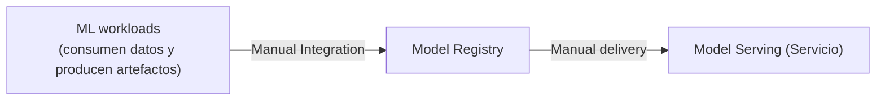
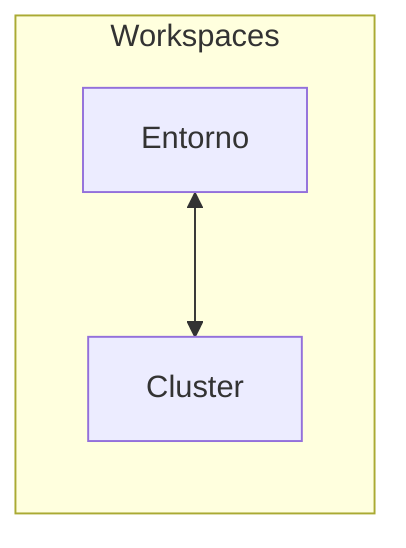
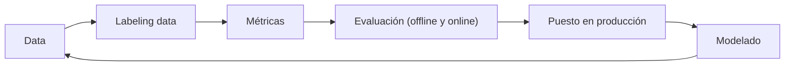

!!! warning

    Contenido transcrito automáticamente a partir de apuntes manuscritos. Puede
    contener errores de lectura y está pendiente de revisión.

## Fundamentos de MLOps

Herramientas mencionadas: ZenML, MLflow.

No es solo crear modelos: hay otros problemas a la hora de llevarlo a producción (el _ML
engineer_ dedica un 10 % a ML y un 90 % a ingeniería).

Roles habituales en un proyecto de ML:

- **Data scientist**: descubrir datos en bruto, desarrollar _features_, entrenar
  modelos.
- **Data Engineer**: productivizar el _pipeline_ de datos.
- **ML engineer**: desplegar el modelo.
- **Product Engineer**: integrar el servicio.
- **Site Reliability Engineer**: configurar la monitorización.

**Deployment**: cómo incorporar modelos en productos disponibles para usuarios.


Un cambio en una parte requiere realizar cambios en el resto de partes, por ejemplo:
cambios de modelo, actualización de datos, retiquetación, etc. Es un modelo continuo
(anotación manuscrita: "técnicas de software tradicionales").

Los datos son la parte más importante para hacer el sistema fiable y eficiente.

Tomar métricas después del _deployment_ del modelo, como la latencia, los sesgos, la
explicabilidad, etc.

El _deployment_ es lento: es donde más se consume el tiempo.

- **Model-centric**: los datos son fijos y se mejora el código/modelo.
- **Data-centric**: los modelos son fijos y se mejoran los datos (anotación: este suele
  ser el enfoque más importante, más fiel a la realidad).

Debemos preguntarnos cuál es el problema del negocio:

- Tipo de problema: supervisado, no supervisado.
- Qué información obtener (_domain specific_).
- Obtener el error de predicción y qué supone.

Consideraciones adicionales:

- ROI: retorno de inversión.
- Quién es el usuario final.
- Tener en cuenta el coste de datos, almacenamiento, etc.

¿Realmente necesitamos IA?

## ZenML: pipelines de machine learning

Vamos a utilizar **ZenML** para desarrollar, ejecutar y gestionar sistemas de ML. Basado
en _pipelines_, para que sea colaborativo, organizado y reproducible.

**RAY**: es un _framework_ para escalar y realizar productos usando aplicaciones de ML.



ZenML permite instalar integraciones (consultar la documentación web).

!!! note "Figura del original"

    Captura de pantalla de un repositorio ZenML ("ZenML repository") mostrando el
    primer _pipeline_ ("First Pipeline") con tres componentes conectados en
    secuencia: Importer, SVC Trainer y Evaluator. Anotaciones manuscritas: "Repositorio
    creado" (señalando la captura) y "cada componente del pipeline" (señalando las
    cajas). Nota en rojo: "Ejemplo usando SVM (Support Vector Machine) para
    clasificación (SVC)".

```python
from zenml import step
from typing_extensions import Annotated

# En ZenML hay que especificar lo que devuelve la función, para que el
# siguiente step sepa lo que llega.


@step
def importer() -> Tuple[Annotated[np.array, "x_train"], Annotated[..., "x_test"], ...]:
    ...


@step
def svc_trainer(x_train: np.ndarray, y_train: np.ndarray):
    ...


@step
def evaluator(...):
    ...
```

Definidos los pasos, creamos un _pipeline_:

```python
from zenml import pipeline


@pipeline
def digitos_pipeline():
    # 1. step
    # 2. step
    # 3. step
    ...
```

Recuadro con credenciales por defecto: usuario `default`, contraseña sin anotar.

Lo mejor, buena práctica, a la hora de crear un proyecto es establecer una jerarquía de
carpetas:

```text
data/
pipelines/
saved_models/
steps/
    __init__.py
run_pipeline.py
```

Podemos integrar ZenML con Weights & Biases o MLflow.

## Diseño de sistemas de ML

**Cluster**: grupo de servidores para crear un único sistema. Habrá un nodo central
(_head node_) que gestiona todos los clústeres y que se conecta a nodos trabajadores
(_worker nodes_). Estos nodos pueden ser fijos (en prestaciones) o escalar
automáticamente (dependiendo de las necesidades).



Se utiliza **Ray**:

```python
import ray

# Inicializar Ray
if ray.is_initialized():
    ray.shutdown()
ray.init()
```

Para ver los recursos del clúster podemos usar `ray.cluster_resources()`.

Primero se debe realizar un diseño del producto que responda a las preguntas ¿qué? y
¿por qué?, para posteriormente realizar el diseño del sistema que responde a ¿cómo?



Anotaciones sobre el diagrama: las métricas son dependientes del problema, el tipo de
dato y el modelo a utilizar, etc. La evaluación _offline_ se realiza antes de
producción, sobre el conjunto de test.

Sobre el modelado:

- Continuo con el sistema, que proporcione resultados con los que comparar todos los
  modelos.
- Empezar con modelos más simples.
- Probar modelos internamente (evaluación, casos no contemplados, recopilación de datos,
  etc.).

## Datos

Primero se inyecta desde el origen y se realiza una división en _train_, _test_ y
_valid_. Obviamente estos datos tienen diferentes ubicaciones y formatos.

También se recomienda el _stratify_ de scikit-learn basado en las etiquetas.

**EDA** (_Exploratory Data Analysis_): proceso cíclico que puede requerir una revisita
con la evolución de los datos.

- Visualizar gráficos para obtener información relevante de los datos.
- Cuestionar si la cantidad de datos es suficiente.
- Extraer _insights_ (ideas).

**Data preprocessing**:

- _Preparation_: organizar y limpiar los datos.
- _Transformation_: _feature encoding and engineering_.

Preparación: eliminar/completar datos sin información, eliminar _outliers_, _feature
engineering_.

Transformation: escalado (normalización), _encoding_ (PCA, Auto Encoder, _counts_/
_n-gram_, _similarity_, etc.).

Datos no balanceados:

- Data augmentation.
- Eliminación de muestras.
- Asignar pesos por clase.

El objetivo es realizar estos procedimientos de manera distribuida, utilizando Ray para
dividir la carga entre todas las máquinas disponibles (_workers_).

Además de Ray existen otras herramientas como Apache Spark, Dask, Modin, etc. Pero Ray
requiere los mínimos cambios y es todo con Python.

Lo primero es asegurar la reproducibilidad y los resultados deterministas. Luego se
realizan las operaciones necesarias (consultar la documentación para ajustar el código
de Pandas a Ray). Después se hace un mapeado distribuido con `map_batches` para mapear
nuestras funciones de preprocesado entre los diferentes _batches_ de los datos de manera
distribuida.

## Modelos

Lo primero es crear un modelo base con el que comparar las mejoras: ha de ser lo más
simple posible e ir iterando. Por ejemplo, definir reglas if-else, añadir complejidad y
evaluar _trade-offs_ (latencia, _throughput_, tamaño, etc.).

Lo que buscamos con Ray, o plataformas similares, es obtener la ventaja de la
escalabilidad en sistemas distribuidos, sin tener que lidiar con:

- _Set-up_ de clústeres individualmente.
- Escribir código complejo.
- Comunicaciones entre equipos.
- Tolerancia, en grandes cargas de trabajo.

En el entrenamiento distribuido hay un nodo central que es responsable de la
orquestación, y los _workers_ entrenan el modelo y entregan el resultado al _head node_.

Consultar la documentación de cada _framework_ a utilizar, pero en general lo que se
necesita es: cargar la división de los datos a los _workers_, preparar el modelo para la
generación distribuida, ajustar el _batch size_ para los _workers_, y realizar un
_report_ de las métricas y guardar los _checkpoints_ del modelo.

Hay que definir un `ScalingConfig` que especifica cómo queremos escalar el
entrenamiento: el número de _workers_, si usan GPU, los recursos por _worker_ y cuánta
CPU pueden usar.

Luego se puede definir `CheckpointConfig` para ir guardando el modelo durante el
entrenamiento.

`RunConfig` para especificar el nombre de la ejecución y dónde guardar los
_checkpoints_. También incluye parámetros de parada que pueden ser utilizados con
métricas, valores, tiempo transcurrido, etc.

Ray cuenta con un _dashboard_ que se puede visualizar conforme el modelo se está
entrenando, para inspeccionar el consumo de recursos de cada _worker_.

Para la evaluación: nos quedamos con el mejor _checkpoint_ y utilizamos el dataset de
test.

Optimizaciones:

- **Pruning**: eliminar partes del modelo para reducir el tamaño.
- **Cuantización**: reducir la precisión numérica.
- **Distillation**: modelo maestro-esclavo para que este último aprenda a copiar.

## Seguimiento de experimentos y ajuste de hiperparámetros

Ray se puede combinar con W&B o MLflow para realizar _tracking_ de los procesos y
manejar todos los componentes de los experimentos, como parámetros, métricas, modelos,
etc. Esto permite un flujo organizado, reproducible, y con un _log_ (registro).

MLflow es 100 % gratuito y _open-source_ → local. Normalmente los artefactos generados
serían almacenados de forma remota, como en S3, en producción, con un servicio de bases
de datos (SQL).

Para el ajuste de hiperparámetros, Ray cuenta con **Ray Tune**, que tiene integración
con HyperOpt. Se define un espacio de pruebas, valores posibles, algoritmo de búsqueda,
etc., y se puede visualizar utilizando MLflow. Luego se puede quedar con aquellos
parámetros con mejor métrica.

## Evaluación de modelos

- Ser claros con las métricas que estamos priorizando.
- Ser cuidadosos para no sobre-optimizar en una métrica específica, porque podemos estar
  comprometiendo algo.

La métrica **F1** es una medida de precisión en las tareas de clasificación. Es la media
armónica de la precisión y la exhaustividad (tasa de verdaderos positivos).

$$
F_1 = 2 \cdot \frac{\text{precisión} \cdot \text{exhaustividad}}{\text{precisión} +
\text{exhaustividad}}
$$

Es útil cuando las clases están desequilibradas. Un valor de F1 más alto indica una
mejor precisión y exhaustividad.

- Estudiar la interpretabilidad de los modelos, si es posible: GradCAM, SHAP (_Shapley
  Additive Explanations_), LIME (_Local Interpretable Model-agnostic Explanations_).

!!! note "Figura del original"

    Captura de pantalla con cuatro combinaciones de _accuracy_ y _loss_ (texto en
    inglés en el original):

    - ↓ accuracy, ↑ loss = large errors on lots of data (worst case)
    - ↓ accuracy, ↓ loss = small errors on lots of data, distributions are close but
      tipped towards misclassifications (misaligned)
    - ↑ accuracy, ↑ loss = large errors on some data (incorrect predictions have very
      skewed distributions)
    - ↑ accuracy, ↓ loss = no/few errors on some data (best case)

## Pruebas A/B, canary y shadow testing

En el _shadow test_ se pierde la retroalimentación por parte del usuario final, ya que
el nuevo sistema no sirve resultados a los usuarios reales.

## Despliegue (serving)

A la hora de desplegar un modelo, algunas consideraciones son:

- **Pythonic**: evitar aprender otro lenguaje → ahorro de tiempo.
- **Framework agnostic**: compatibilidad e interoperabilidad (PyTorch, TensorFlow,
  etc.).
- **Auto escalable**.
- **Modular**: servicios combinados e integraciones.

Tipos de inferencia:

- **Batch inference**: más eficiente (predicción acumulada, no se da el resultado
  conforme se recibe los datos).
- **Online inference**: se recibe el dato → predicción; más costoso.

## Desarrollo y utilidades

**Developing**:

- **Typer**: herramienta para crear CLI para nuestros programas.

**Utilities**:

- _Logging_.

## Testing

- Crear sistemas de ML de los que podemos fiarnos e iterar sobre ellos.
- Obtener un resultado esperado.
- Detectar fallos con antelación, reducir costes y tiempo.

Tipos de tests:

- **Unit tests**: testear componentes individuales, que solo tienen una función.
- **Integration tests**: testear funcionalidades combinadas de componentes individuales.
- **System tests**: test en el diseño del sistema, para obtener las salidas esperadas.
- **Acceptance tests**: tests para verificar que los requisitos se cumplen (UAT ≡ _User
  Acceptance Testing_).
- **Regression tests**: test basado en errores anteriores, para ver si se han corregido.

¿Cómo tenemos que hacer los tests?

- **Arrange**: establecer las diferentes entradas a probar.
- **Act**: aplicar las entradas en los componentes que queremos probar.
- **Assert**: confirmar que hemos obtenido la salida esperada.

Herramientas: `unittest`, `pytest`.

## Contenido eliminado por estar ya en la wiki

| Tema eliminado                                                                                | Ya cubierto en                                                                |
| --------------------------------------------------------------------------------------------- | ----------------------------------------------------------------------------- |
| Analogía MLOps/DevOps como conjunto de buenas prácticas                                       | `docs/06_operations/section_4_experiment_management.md`                       |
| Fórmulas de precisión y exhaustividad ($TP$, $FP$, $FN$)                                      | `docs/07_artificial_intelligence/02_machine_learning/section_4_evaluation.md` |
| Concepto de matriz de confusión                                                               | `docs/07_artificial_intelligence/02_machine_learning/section_4_evaluation.md` |
| Explicación general de AB testing, canary testing y shadow testing (con diagramas de tráfico) | `docs/06_operations/section_5_deployment.md`                                  |

## Procedencia

Transcrito a partir de `Cursos/MLOps/Apuntes.pdf` (dentro de `notas_ml.zip`), páginas 1
a 8. Documento podado: se ha eliminado el contenido ya cubierto con igual o mayor
profundidad en la wiki publicada (ver tabla anterior).
