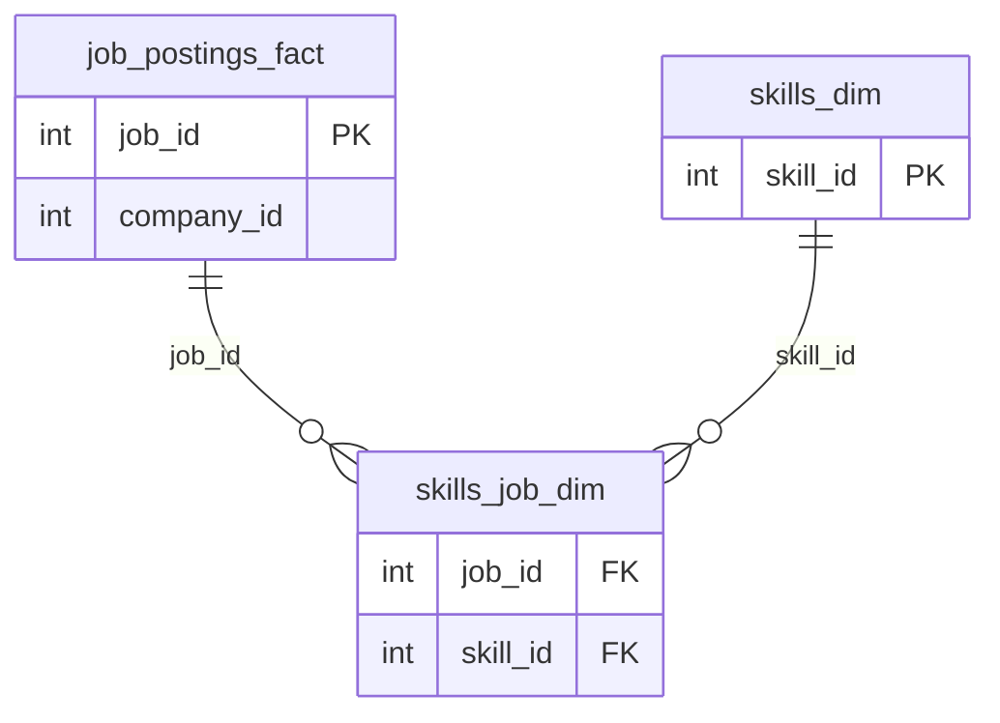

!!! warning

    Contenido transcrito automáticamente a partir de apuntes manuscritos. Puede
    contener errores de lectura y está pendiente de revisión.

## Introducción

Como motor de base de datos se puede usar SQLite o PostgreSQL.

`Ctrl + Enter` ejecuta la query.

## Operadores y comparadores

El operador `>` permite datos no categóricos.

## Comodines (_wildcards_)

!!! note "Figura del original"

    Comodines adicionales mencionados en la figura original, no cubiertos en la wiki:

    - `[]`: representa cualquier carácter individual dentro de los corchetes. Por
      ejemplo, para buscar todas las palabras que empiezan con "b", "s" o "p", se puede
      usar `'[bsp]%'`.
    - `-`: representa cualquier carácter individual dentro del rango especificado. Por
      ejemplo, para buscar todas las palabras que empiecen con "a", "b", "c", "d", "e" o
      "f", se puede usar `'[a-f]%'`.

## Joins

!!! note "Figura del original"

    Diagrama del procesamiento interno de una consulta en la base de datos, más
    eficiente y lógico:

    ```mermaid
    flowchart TD
        Statement --> Parser
        Parser --> QueryTree["Query Tree"]
        QueryTree --> Optimizer
        Optimizer --> ExecutionPlan["Execution Plan"]
        Optimizer --> ExecutionPlanCache["Execution Plan Cache"]
        ExecutionPlan --> Executor
        Executor --> ResultSet["Result Set"]
        ResultSet --> DataAccessLogic["Data Access Logic"]
        DataAccessLogic --> Statement
        %% [?] relacion inferida: las flechas entre "Data Access Logic" y
        %% "Statement"/"Result Set" son ambiguas en el original
    ```

## Instalación de PostgreSQL

Las extensiones de VS Code para trabajar con PostgreSQL ("SQLTools" y "SQLTools
PostgreSQL") son de Matheus Teixeira.

## Diseño de bases de datos y claves foráneas

Todas las tablas dentro de la misma base de datos. `job_id` en `job_postings_fact` es la
clave principal; `job_id` y `skill_id` en `skills_job_dim` son claves foráneas hacia
`job_postings_fact` y `skills_dim` respectivamente.



```sql
CREATE TABLE public.job_postings_fact (
    job_id INT PRIMARY KEY,
    company_id INT,
    job_title_short VARCHAR(255),
    job_title TEXT,
    job_location TEXT,
    job_via TEXT,
    job_schedule_type TEXT,
    job_work_from_home BOOLEAN,
    search_location TEXT,
    job_posted_date DATE,
    job_no_degree_mention BOOLEAN,
    job_health_insurance BOOLEAN,
    job_country TEXT,
    salary_rate TEXT,
    salary_year_avg NUMERIC,
    salary_hour_avg NUMERIC,
    FOREIGN KEY (company_id) REFERENCES public.company_dim (company_id)
);
```

```sql
-- Create skills_job_dim table with a composite primary key and foreign keys
CREATE TABLE public.skills_job_dim (
    job_id INT,
    skill_id INT,
    PRIMARY KEY (job_id, skill_id),
    FOREIGN KEY (job_id) REFERENCES public.job_postings_fact (job_id),
    FOREIGN KEY (skill_id) REFERENCES public.skills_dim (skill_id)
);
```

## Bases de datos NoSQL

**DBMS** = _Database Management System_. NoSQL es un enfoque (_an approach_) a la
gestión de bases de datos.

### Wide-column database type

- `CQL` = Cassandra Query Language.
- `rdbms` = relational database management system.
- _Partition_ / _clustering keys_.

### Document database type

Formato `json`.

- No requieren _joins_.
- Colecciones jerárquicas y datos no normalizados.
