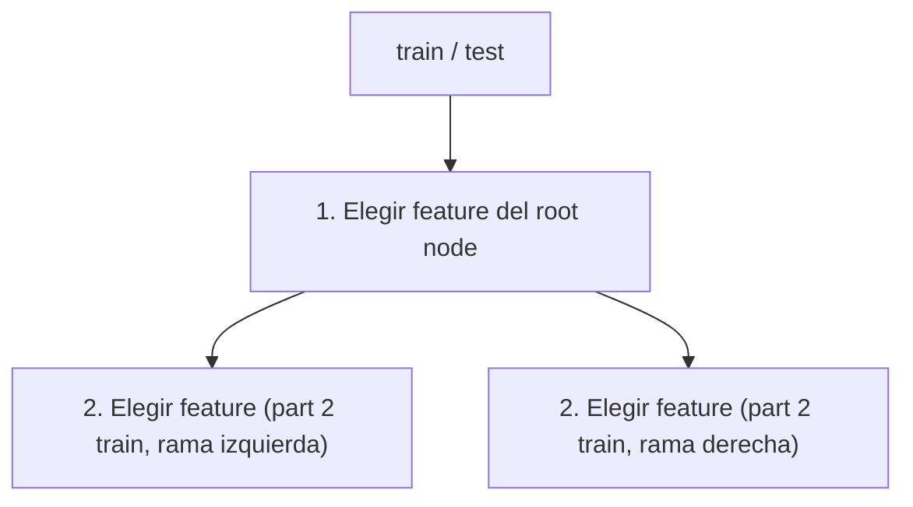
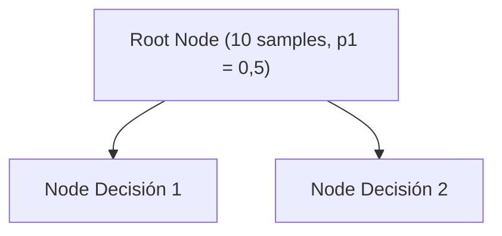
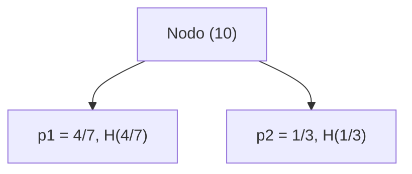

!!! warning

    Contenido transcrito automáticamente a partir de apuntes manuscritos. Puede
    contener errores de lectura y está pendiente de revisión.

## Árboles de decisión

### Estructura y construcción

El proceso de construcción sigue dos pasos:

1. Elegir el feature para el root node.
2. Elegir otros features para los nodos de decisión siguientes.

Para ello se divide el conjunto de datos en train y test, y dentro del propio train se
reserva una segunda parte (part 2 train) para cada rama tras la primera división:
<!-- revisar: posible solape con docs/07_artificial_intelligence/02_machine_learning/section_2_supervised_models.md -->

### Cuándo detener las divisiones

Las divisiones se detienen cuando ocurre alguna de estas condiciones:

- Cuando un nodo es 100% de una clase.
- Si la pureza no mejora o empeora.

### Medición de la pureza: entropía

Se usa la **entropía** para medir la impureza. La entropía $H(p_x)$, en función de $p_x$
(la proporción de ejemplos de la clase $x$), es una curva que parte de 0 en $p_x = 0$,
alcanza su valor máximo de 1 en el punto intermedio y vuelve a 0 en $p_x = 1$.

Ejemplo con los datos `1 1 1 1 1 0` (0 = perro, 1 = gato):

$$
p_1 = \frac{5}{6} = 0{,}83 \qquad p_0 = \frac{1}{6}
$$

Sobre la misma curva $H(p_x)$, para $p_1 = 5/6$ se lee $H(p_1) = 0{,}6$.

Dado que $\log(0)$ no está definido, se adopta la siguiente notación:

$$
0 \cdot \log(0) = 0
$$

Con $p_0 = 1 - p_1$, la entropía se expresa como:

$$
H(p_1) = -p_1 \log_2(p_1) - p_0 \log_2(p_0) = -p_1 \log_2(p_1) - (1 - p_1)
\log_2(1 - p_1)
$$

!!! note "Figura del original"

    Diapositiva "Choosing a split" con tres posibles divisiones sobre un conjunto de
    10 train samples de gatos y perros:

    - **Ear shape** (Pointy / Floppy): $p_1 = 4/5 = 0.8$ (5/10 muestras),
      $p_1 = 1/5 = 0.2$ (5/10 muestras); $H(0.8) = 0.72$, $H(0.2) = 0.72$.
      Reducción de incertidumbre:
      $H(0.5) - \left(\frac{5}{10}H(0.8) + \frac{5}{10}H(0.2)\right) = 0{,}28$.
    - **Face Shape** (Round / Not round): $p_1 = 4/7 = 0.57$, $p_1 = 1/3 = 0.33$;
      $H(0.57) = 0.99$, $H(0.33) = 0.92$. Reducción de incertidumbre:
      $H(0.5) - \left(\frac{7}{10}H(0.57) + \frac{3}{10}H(0.33)\right) = 0{,}03$.
    - **Whiskers** (Present / Absent): $p_1 = 3/4 = 0.75$, $p_1 = 2/6 = 0.33$;
      $H(0.75) = 0.81$, $H(0.33) = 0.92$. Reducción de incertidumbre:
      $H(0.5) - \left(\frac{4}{10}H(0.75) + \frac{6}{10}H(0.33)\right) = 0{,}12$.

    Anotación manuscrita junto al resultado de Ear shape (0,28, resaltado en
    naranja): "este es mejor, mayor reducción de la incertidumbre".

Calculamos la entropía del primer árbol y vemos que $p_1 = 5/10 = 0{,}5$, por lo que
$H(p_1) = 1$. Restamos esa incertidumbre para saber la información de la ganancia.

### Ganancia de información

Ejemplo con 10 muestras `1 1 0 0 1 1 0 1 0 0` (0 = perro, 1 = gato). En el root node,
$p_1^{\text{root}} = 5/10 = 0{,}5$:

- Node Decisión 1, datos `1 0 1 1 1`: $p_1^{\text{izq}} = 4/5$, $w^{\text{izq}} = 5/10$
  (división de datos del nodo).
- Node Decisión 2, datos `0 1 0 0 0`: $p_1^{\text{der}} = 1/5$, $w^{\text{der}} = 5/10$.

La ganancia de información se define como:

$$
H\left(p_1^{\text{root}}\right) - \left(w^{\text{izq}}
H\left(p_1^{\text{izq}}\right) + w^{\text{der}} H\left(p_1^{\text{der}}\right)\right)
$$

Esto permite mejorar la pureza, y podemos usarlo como medidor del umbral utilizado para
características continuas.

Si los datos son categóricos, podemos usar **one-hot encoding**.

Otro ejemplo de división, sobre 10 muestras:

$$
H\left(\frac{5}{10}\right) = \frac{7}{10} H\left(\frac{4}{7}\right) + \frac{3}{10}
H\left(\frac{1}{3}\right)
$$

### Selección aleatoria de características en Random Forest

Si tenemos $n$ características, Random Forest coge en cada división un valor aleatorio
de $k < n$ características; normalmente se elige $k = \sqrt{n}$.

### Ventajas y limitaciones

Los árboles de decisión:

- Funcionan bien en datos tabulares (datos estructurados).
- No son aptos para datos no estructurados como imágenes, audio, etc.
- Son rápidos.
- Si son pequeños, son relativamente interpretables.

## Support Vector Machine (SVM)

- Un hiperplano en 1D es un punto, en 2D una línea y en 3D una superficie que divide el
  espacio en partes.

!!! note "Figura del original"

    Diapositiva "2 Dimensional Cases" con dos ejemplos de puntos rojos y amarillos:

    - **Figure 1 — Linearly Separable**: los puntos rojos y amarillos quedan
      separados por una línea recta.
    - **Figure 2 — None-Linearly Separable**: los puntos amarillos se agrupan en el
      centro rodeados por una circunferencia, con los puntos rojos fuera de ella; no
      son separables mediante una línea recta.<!-- revisar: posible solape con docs/07_artificial_intelligence/02_machine_learning/section_2_supervised_models.md -->

SVP[?] maximiza el margen de separación entre los puntos de datos.

!!! note "Figura del original"

    Imagen con tres hiperplanos paralelos H0, H1 y H2, y un vector $\vec{w}$
    perpendicular a los tres. Entre H1 y H2 se marca en verde la región del margen,
    con vectores dibujados desde el origen hacia los puntos de las muestras. Junto a
    H1 se indica "muestras positivos" y junto a H2, "muestras negativas".

Distancia de la proyección:

$$
\frac{\vec{w} \cdot \vec{x}}{\|\vec{w}\|} = c
$$

Para H0:

$$
\vec{w} \cdot \vec{x} + b = 0
$$

donde $\vec{w} \cdot \vec{x}$ es el producto vectorial (suma de productos de cada
componente; en 2D son 2 componentes, en 3D son 3, etc.).

Si $\vec{w} \cdot \vec{x} + b \geq 0$, la muestra es una muestra positiva.

Para H1 y H2, con $K$ el valor de corte:

$$
\vec{w} \cdot \vec{x} + b = K \qquad \vec{w} \cdot \vec{x} + b = -K
$$

Anchura del margen:

$$
\frac{\frac{1}{2} \vec{w} \cdot \vec{w}}{\|\vec{w}\|^2}
$$

## Contenido eliminado por estar ya en la wiki

| Tema eliminado                                                               | Ya cubierto en                                                                       |
| ---------------------------------------------------------------------------- | ------------------------------------------------------------------------------------ |
| Estructura del árbol (root node, decision nodes, leaf nodes, profundidad)    | `docs/07_artificial_intelligence/02_machine_learning/section_2_supervised_models.md` |
| Criterio de división basado en maximizar la pureza                           | `docs/07_artificial_intelligence/02_machine_learning/section_2_supervised_models.md` |
| Criterios de parada: profundidad máxima y número mínimo de muestras por nodo | `docs/07_artificial_intelligence/02_machine_learning/section_2_supervised_models.md` |
| Relación entre profundidad y sobreajuste                                     | `docs/07_artificial_intelligence/02_machine_learning/section_2_supervised_models.md` |
| Random Forest: combinación de árboles, bootstrap sampling y bagging          | `docs/07_artificial_intelligence/02_machine_learning/section_2_supervised_models.md` |
| XGBoost: gradient boosting, corrección progresiva de errores, regularización | `docs/07_artificial_intelligence/02_machine_learning/section_2_supervised_models.md` |
| SVM: definición general (no lineal, supervisado, hiperplano óptimo)          | `docs/07_artificial_intelligence/02_machine_learning/section_2_supervised_models.md` |

## Procedencia

Contenido transcrito a partir de `Machine Learning/Machine Learning.pdf` (dentro de
`notas_ml.zip`), páginas 1 a 5. La página 6 está en blanco y no contiene apuntes.
Documento podado: se ha eliminado el contenido ya cubierto por la wiki publicada (ver
tabla anterior), conservando únicamente las formulaciones matemáticas, ejemplos
numéricos y detalles que la wiki no recoge.
