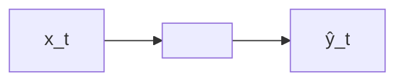
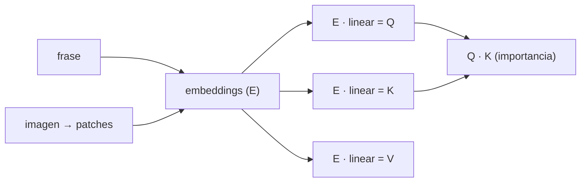

!!! warning

    Contenido transcrito automáticamente a partir de apuntes manuscritos. Puede
    contener errores de lectura y está pendiente de revisión.

## Deep Sequence Models

### Tipos de arquitectura según entrada y salida

Según la relación entre el número de entradas y salidas, se distinguen varios tipos de
problemas:

- **Multiple input → 1 output**: por ejemplo, clasificación de sentimientos.
- **1 input → multiple output**: por ejemplo, generación de texto.
- **Multiple input → multiple output**: por ejemplo, traducción.

El esquema general de estos modelos es el siguiente, donde $\hat{y}_t$ representa la
salida en el instante de tiempo $t$:

$$
\hat{y}_t = f(x_t, h_{t-1})
$$

donde $h_{t-1}$ es la memoria del instante pasado.

### Redes neuronales recurrentes (RNN)

El estado de la celda se calcula como:

$$
h_t = f_W(x_t, h_{t-1})
$$

donde $f_W$ es una función con pesos $W$, $x_t$ es la entrada y $h_{t-1}$ es el estado
anterior.

Los requisitos de este tipo de modelos son:

- Longitud variable.
- Long-term dependencies.
- Orden.
- Compartir parámetros.

Se realiza el algoritmo de **backpropagation** por cada celda, desde la celda $T_x$
hasta llegar a $T_0$.

### Problemas de gradiente

Inicialización de los pesos mediante la matriz identidad, como alternativa a Xavier o
He, para mitigar el vanishing gradient.

## Attention

### Intuición: Query, Key, Value

La intuición detrás de **self-attention** es atender las partes más importantes de la
entrada:

- **Query (Q)** → mi búsqueda en el navegador.
- **Key (K)** → el título del vídeo.
- **Value (V)** → extraigo información de la key con mayor relación.

Me quedo con la key que tenga mayor relación con mi query.

El autor representa mediante tres diagramas de matrices cómo se obtienen $Q$, $K$ y $V$:
en cada caso, una matriz de **positional embedding** (la misma en los tres casos) se
multiplica por una matriz de una capa lineal (con parámetros distintos en cada caso)
para producir, respectivamente, la matriz Query, la matriz Key y la matriz Value.

### Fórmula de atención

$$
\text{Attention}(Q, K, V) = \text{softmax}\left(\frac{QK^T}{\sqrt{d_K}}\right)V
$$

## Deep Generative Models

El autoencoder normal es determinista: los pesos no cambian.

En los **autoencoders variacionales (VAE)** aprendemos una función con su media ($\mu$)
y desviación típica ($\sigma$) para obtener la representación del espacio latente.

Utilizamos la divergencia KL entre dos distribuciones para capturar la divergencia:

$$
-\frac{1}{2} \sum_{j=0}^{k-1} \left(\sigma_j + \mu_j^2 - 1 - \log \sigma_j\right)
$$

### Reparametrización

Backpropagation requiere nodos deterministas: capas deterministas, sin elementos
aleatorios. Para ello, en los VAE se hace re-parametrización:

$$
z \sim N(\mu, \sigma^2) \quad \longrightarrow \quad z = \mu + \sigma \odot \varepsilon
$$

$$
\varepsilon \sim N(0, 1)
$$

donde $\mu$ y $\sigma$ son vectores fijos y $\varepsilon$ es una constante aleatoria de
la distribución estocástica. El backpropagation se realiza sobre $\mu$ y $\sigma$.

El **β-VAE[?]** permite el **latent space disentanglement**, lo que permite una
codificación más eficiente.

## Diffusion

En el proceso forward:

$$
x_0 \rightarrow x_1 \rightarrow \dots \rightarrow x_T
$$

$$
q(x_{1:T} \mid x_0) = \prod_{t=1}^{T} q(x_t \mid x_{t-1})
$$

## Contenido eliminado por estar ya en la wiki

| Tema eliminado                                                                                                          | Ya cubierto en                                                                    |
| ----------------------------------------------------------------------------------------------------------------------- | --------------------------------------------------------------------------------- |
| Conversión de texto a números mediante embeddings, previa al procesamiento en RNN                                       | `docs/07_artificial_intelligence/03_deep_learning/section_5_sequential_models.md` |
| Justificación general de la dependencia entre elementos de una secuencia                                                | `docs/07_artificial_intelligence/03_deep_learning/section_5_sequential_models.md` |
| Vanishing/exploding gradients: causas, síntomas y mitigación general (ReLU, escalado/clipping, cambios de arquitectura) | `docs/07_artificial_intelligence/03_deep_learning/section_3_neural_networks.md`   |
| Comparación de Query y Key para obtener pesos de relevancia/similitud                                                   | `docs/07_artificial_intelligence/03_deep_learning/section_5_sequential_models.md` |
| Generación de embeddings de imagen mediante división en parches (patches)                                               | `docs/07_artificial_intelligence/03_deep_learning/section_4_cnn.md`               |
| Modelos generativos: aprendizaje de la distribución de los datos                                                        | `docs/07_artificial_intelligence/03_deep_learning/section_7_generative_ai.md`     |
| Autoencoders utilizados para detección de anomalías/outliers (out-of-distribution)                                      | `docs/07_artificial_intelligence/03_deep_learning/section_3_neural_networks.md`   |

## Procedencia

Contenido transcrito a partir de `Machine Learning/Mit.pdf` (dentro de `notas_ml.zip`),
páginas 1 a 5. Documento podado: se ha eliminado el contenido ya cubierto por la wiki
publicada (`docs/`); ver la tabla anterior para el detalle de los temas retirados y su
ubicación de referencia.
