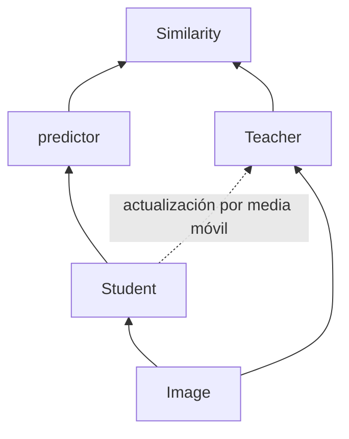

!!! warning

    Contenido transcrito automáticamente a partir de apuntes manuscritos. Puede
    contener errores de lectura y está pendiente de revisión.

## SwAV: Swapping Assignments between Views

Utiliza un algoritmo de **clustering A**, apoyado en la **teoría de transporte** y la
**distancia de Wasserstein**. Esta distancia se utiliza para medir la distancia entre
dos distribuciones de probabilidad, y esa distancia se puede usar para comparar y
ajustar las distribuciones de los datos en diferentes clusters.

## BYOL



La relación entre el student y el teacher se expresa como:

$$
f_\theta^{\text{student}}(I) = f_\theta^{\text{teacher}}(T[I])
$$

con actualización del teacher mediante media móvil (**moving average**).

## Barlow Twins

!!! note "Figura del original"

    Diapositiva "Barlow Twins Objective Function" que muestra el esquema del
    método: un par de imágenes distorsionadas se pasan por la misma red $f_\theta$
    (backprop compartido) para obtener las representaciones $Z^A$ y $Z^B$, a
    partir de las cuales se calcula la matriz de correlación cruzada empírica
    $\mathcal{C}$ y se compara contra la correlación cruzada objetivo (una matriz
    identidad).

La correlación cruzada empírica se define como:

$$
C_{ij} \triangleq \frac{\sum_b z_{b,i}^A z_{b,j}^B}{\sqrt{\sum_b \left(z_{b,i}^A\right)^2}
\sqrt{\sum_b \left(z_{b,j}^B\right)^2}}
$$

y la función de pérdida de Barlow Twins como:

$$
\mathcal{L}_{BT} \triangleq \sum_i (1 - C_{ii})^2 + \lambda \sum_i \sum_{j \neq i} C_{ij}^2
$$

donde el primer término es el **invariance term** y el segundo, el **redundancy
reduction term**.

!!! note "Figura del original"

    Diapositiva "Barlow Twins - easy to implement" con el siguiente pseudocódigo:

    ```python
    # f: encoder network
    # lambda: weight on the off-diagonal terms
    # N: batch size
    # D: dimensionality of the representation
    #
    # mm: matrix-matrix multiplication
    # off_diagonal: off-diagonal elements of a matrix
    # eye: identity matrix

    for x in loader:  # load a batch with N samples
        # two randomly augmented versions of x
        y_a, y_b = augment(x)

        # compute representations
        z_a = f(y_a)  # NxD
        z_b = f(y_b)  # NxD

        # normalize repr. along the batch dimension
        z_a_norm = (z_a - z_a.mean(0)) / z_a.std(0)  # NxD
        z_b_norm = (z_b - z_b.mean(0)) / z_b.std(0)  # NxD

        # cross-correlation matrix
        c = mm(z_a_norm.T, z_b_norm) / N  # DxD
    ```

!!! note "Figura del original"

    Diapositiva final ("Thanks!") que clasifica los métodos de self-supervised
    learning en cuatro familias, cada una representada mediante un esquema de
    encoders y flechas de gradiente: **contrastive** (Wu et al., 2018; He et al.,
    2019; Misra y van der Maaten, 2019; Chen et al., 2020), **clustering** (Asano
    et al., 2019; Caron et al., 2020), **distillation**, con un student encoder y
    un teacher encoder (Grill et al., 2020; Chen y He, 2020), y **redundancy
    reduction** (Zbontar et al., 2021). Anotaciones manuscritas en rojo asociadas:
    junto a contrastive, "datos multi-modales"; junto a clustering, "converge
    antes[?]"; junto a redundancy reduction, "más fácil de implementar".

## Pérdidas contrastivas

Los métodos contrastivos también pueden ser utilizados en métodos supervisados,
utilizando las propias etiquetas.

## Contenido eliminado por estar ya en la wiki

| Tema eliminado                                                                                                                                                                                                  | Ya cubierto en                                                                                                                                                    |
| --------------------------------------------------------------------------------------------------------------------------------------------------------------------------------------------------------------- | ----------------------------------------------------------------------------------------------------------------------------------------------------------------- |
| Motivación del self-supervised learning (coste del etiquetado, definición del "self", técnicas de pretexto: in-painting, invarianza a rotaciones, predicción de localización de patches, fine-tuning posterior) | `docs/07_artificial_intelligence/03_deep_learning/section_6_other_paradigms.md`                                                                                   |
| Invarianza a la aumentación de datos y SimCLR (ecuación de invarianza $f_\theta(I)=f_\theta(T[I])$, pérdida contrastiva genérica basada en distancia, importancia de los negativos)                             | `docs/07_artificial_intelligence/03_deep_learning/section_4_cnn.md` (SimCLR ya explicado vía la fórmula InfoNCE, con negativos y pares positivos por aumentación) |
| Lista de funciones de pérdida contrastivas (Triplet Loss, Contrastive Loss, NT-Xent Loss)                                                                                                                       | `docs/07_artificial_intelligence/03_deep_learning/section_4_cnn.md` (mismas pérdidas ya explicadas con sus fórmulas: Triplet Loss, Contrastive Loss e InfoNCE)    |

## Procedencia

Contenido transcrito y podado a partir de `Machine Learning/SSL.pdf` (dentro de
`notas_ml.zip`), páginas 1 y 2. Se ha eliminado la información ya presente en la wiki
publicada (ver tabla anterior); el contenido restante corresponde a métodos con nombre
propio (SwAV, BYOL, Barlow Twins) y sus formulaciones matemáticas, no cubiertos en
`docs/`.
