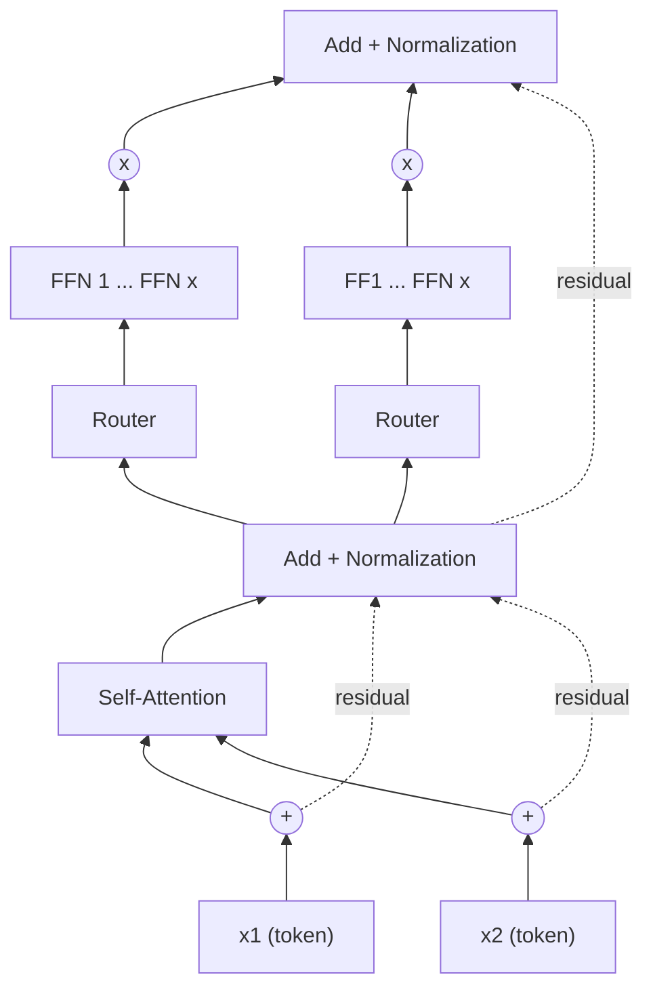

!!! warning

    Contenido transcrito automáticamente a partir de apuntes manuscritos. Puede
    contener errores de lectura y está pendiente de revisión.

## Mixture of Experts (MoE)

Los modelos más grandes son más eficientes con respecto al número de muestras. La
dispersión (**sparsity**) se emplea como una nueva dimensión usada para escalar
arquitecturas: los pesos dependerán de la entrada, de forma que ésta recibirá el mismo
cómputo pero distintos pesos según el caso.

Tendremos múltiples expertos por red, cada uno implementando una pequeña red, junto con
una red adicional (**gating network**) que devuelve la distribución de probabilidades
según la cual dirigir la entrada al experto oportuno, mediante **Softmax**. Podemos
elegir varios expertos a la vez.

### Switch Transformer

Consiste en cambiar la FFN del transformer por MoE. Sus características son:

- Permite menor precisión en float32.
- No es estable con float16.
- Es más propenso al overfitting, por lo que se incrementa el drop-out.
- Ofrece un mapeo eficiente al hardware.
- Utiliza **"Load Balance Across Experts"** para distribuir de forma homogénea la misma
  cantidad de tokens por cada experto.
- Problema: es un **statically compiled graph**, pero se trata de una **dynamic
  architecture**. Esto se resuelve con un hiperparámetro, el **capacity factor**: si un
  experto no tiene capacidad, los tokens sobrantes se descartan. El compilador de
  TensorFlow (XLA) usa un `static shape` para todos los tensores.
- Obtiene mejores resultados incluso con 2 expertos que la FFN del modelo base.
- Utiliza paralelización en datos y entre expertos.
- Incrementar el número de expertos incrementa el número de parámetros, pero no el
  número de FLOPS.



Código (pseudo/real) de un experto individual:

```python
class Expert():
    def __init__(self, input_dim, hidden_dim, output_dim):
        super(Expert, self).__init__()
        self.layer1 = Linear(input_dim, hidden_dim)
        self.layer2 = Linear(hidden_dim, output_dim)

    def forward / call(self, x):
        x = ReLU(self.layer1)
        return Softmax(self.layer2(x), dim=1)
```

!!! note "Figura del original"

    Captura de una diapositiva (título parcialmente cortado, "... Experts in AI
    and Deep Learning") con la implementación en PyTorch de la red de gating y
    del módulo de Mixture of Experts. Anotación manuscrita en rojo junto a la
    última capa de `Gating`: "Salida: Igual al número de expertos".

    ```python
    class Gating(nn.Module):
        def __init__(self, input_dim,
                     num_experts, dropout_rate=0.1):
            super(Gating, self).__init__()

            # Layers
            self.layer1 = nn.Linear(input_dim, 128)
            self.dropout1 = nn.Dropout(dropout_rate)

            self.layer2 = nn.Linear(128, 256)
            self.leaky_relu1 = nn.LeakyReLU()
            self.dropout2 = nn.Dropout(dropout_rate)

            self.layer3 = nn.Linear(256, 128)
            self.leaky_relu2 = nn.LeakyReLU()
            self.dropout3 = nn.Dropout(dropout_rate)

            self.layer4 = nn.Linear(128, num_experts)

        def forward(self, x):
            x = torch.relu(self.layer1(x))
            x = self.dropout1(x)

            x = self.layer2(x)
            x = self.leaky_relu1(x)
            x = self.dropout2(x)

            x = self.layer3(x)
            x = self.leaky_relu2(x)
            x = self.dropout3(x)

            return torch.softmax(self.layer4(x), dim=1)
    ```

    ```python
    class MoE(nn.Module):
        def __init__(self, trained_experts):
            super(MoE, self).__init__()
            self.experts = nn.ModuleList(trained_experts)
            num_experts = len(trained_experts)
            # Assuming all experts have the same input dimension
            input_dim = trained_experts[0].layer1.in_features
            self.gating = Gating(input_dim, num_experts)

        def forward(self, x):
            # Get the weights from the gating network
            weights = self.gating(x)

            # Calculate the expert outputs
            outputs = torch.stack(
                [expert(x) for expert in self.experts], dim=2)

            # Adjust the weights tensor shape to match the expert
            # outputs
            weights = weights.unsqueeze(1).expand_as(outputs)

            # Multiply the expert outputs with the weights and
            # sum along the third dimension
            return torch.sum(outputs * weights, dim=2)
    ```

## Cuantización de modelos (Quantization)

La cuantización consiste en reducir la precisión de los modelos para reducir su tamaño.
El motivo principal es el incremento de parámetros de los modelos, sobre todo con el uso
de LLMs.

Formas de comprimir modelos (SOTA 2024):

- **Pruning**: eliminar capas o neuronas teniendo en cuenta métricas como el valor de
  los pesos.
- **Knowledge distillation**: pasar de un modelo mayor a uno menor, aunque requiere
  memoria para entrenar el modelo más grande.
- **Quantization**: por defecto se usa float32 (4 bytes), que se puede convertir a Int8
  (1 byte). Esta conversión introduce un error de cuantización.

### Tipos numéricos

**Integer**:

- Unsigned: rango $[0, 2^n - 1]$, para $n$ bits. Con 8 bits: $[0, 255]$.
- Signed integer (complemento a 2): rango $[-2^{n-1}, 2^{n-1} - 1]$. Con 8 bits:
  $[-128, 127]$.
- `torch.iinfo(torch.uint8)` permite obtener el rango.

**Floating** (igual que en la asignatura de 4º de grado): signo, exponente y fracción
(mantisa).

| Tipo                        | Precisión |
| --------------------------- | --------- |
| FP32                        | best      |
| FP16                        | better    |
| BF16 (brain floating point) | good      |

Se sacrifica precisión a cambio de ahorro de memoria. También dependerá del tipo de
problema/dato, y de si se trata de inferencia o entrenamiento.

**Downcasting**: pasar de un tipo de dato de mayor precisión a uno de menor precisión
(pérdida de datos, menor precisión) → **Mixed Precision Training**:

- Reduce la huella de memoria: es más eficiente en el uso de memoria de GPU, permite
  entrenar modelos más grandes y permite un mayor tamaño de lote.
- Aumenta el cómputo y la velocidad, aunque esto depende del hardware.

Hay hardware que no implementa en su kernel FP16 o similares, por lo que al realizar
algún casting puede dar error de compilación. Pero podemos usar BF16.

Podemos calcular el error medio (`abs(bf16 - fp32).mean()`) y el máximo
(`abs(bf16 - fp32).max()`), y así evaluar el impacto de la precisión. Con
`model.get_memory_footprint() / 1e+6` obtenemos la huella de memoria en megabytes.

El error se propaga a lo largo del modelo: al ser recursivo, la capa `lyr(1)` depende de
`lyr(0)`.

### Linear quantization

Se establece una relación lineal entre el rango de precisión que queremos y el rango que
tenemos. Por ejemplo, dada una matriz FP32 con valor máximo 728.6 y valor mínimo -184,
se mapea a INT8 en el rango $[-128, 127]$.

Para cuantizar:

$$
x_q = \operatorname{clip}\left(\operatorname{round}\left(\frac{x_f}{s}\right) + z\right)
$$

donde $x_f$ es el valor a cuantizar, $s$ es la escala, $z$ es el offset o sesgo de
cuantización (**zero point**), y $\operatorname{round}$ se redondea al entero más
cercano. $x_q$ es el valor cuantizado.

El rango puede ser no simétrico ($[-128, 127]$) o simétrico ($[-127, 127]$). $s$ y $z$
son los parámetros del **linear mapping** (**scale** y **zero point**).

Para decuantizar:

$$
\tilde{x}_f = s \cdot (x_q - z)
$$

Este valor es aproximado: existe error de cuantización.

Pasar de INT8 a FP32 (decuantización) también usa una transformación lineal, pero no
devuelve la misma matriz original: existen errores.

Dado el rango $[-128, 127]$:

- **Asimétrica**: $\alpha = r_{min}$, $\beta = r_{max}$, y

    $$
    s = \frac{\beta - \alpha}{2^b - 1}
    $$

- **Simétrica**: $-\alpha = \beta = \max(|r_{min}|, |r_{max}|)$, con $z = 0$.

Anotación manuscrita en rojo junto al diagrama de la recta simétrica: "Weights NN"
(parece referirse a que esta forma simétrica se aplica típicamente a los pesos de la red
neuronal).

Podemos cuantizar solo ciertas capas del modelo, y no el modelo al completo.

**Calibration**: calibrar el modelo cuando se cuantifican las activaciones del modelo.
Como el rango depende de la entrada, se aplica Min/Max, consiguiendo mejores resultados
de activaciones cuantizadas.

`LLM.INT8`: la multiplicación de matrices se divide en dos partes: la parte de los
outliers en float16, y la parte de los non-outliers en int8.

!!! note "Figura del original"

    Captura de un notebook Jupyter con la implementación de una cuantización
    lineal en NumPy.

    ```python
    import numpy as np

    def rango(tipo_dato):
        return np.iinfo(tipo_dato).max, np.iinfo(tipo_dato).min

    np.iinfo(np.int8)
    # iinfo(min=-128, max=127, dtype=int8)

    def cuantizacion_lineal(matrix, tipo_dato):
        value = []

        # Encuentra el valor absoluto máximo en la matriz
        amax = np.max(np.abs(matrix))

        # Asegúrate de que la función 'rango' esté definida y devuelva los
        # valores correctos
        qmax, qmin = rango(tipo_dato)

        # Calcula el factor de escala y el valor de desplazamiento
        s = (2 * amax) / (qmax - qmin)
        z = int(round((qmax - amax) / s))

        # Itera sobre cada valor en la matriz
        for valor in np.nditer(matrix):
            # Aplica la cuantización y agrega el resultado a la lista 'value'
            value.append(
                np.clip((round(valor / s) + z), qmin, qmax).astype(tipo_dato)
            )

        # Devuelve la matriz cuantizada con la misma forma que la matriz
        # original
        return np.array(value).reshape(matrix.shape)

    matrix = np.array(
        [[191.6, -13.5, 728.6], [92.14, 295.5, -184], [0, 684.6, 245.5]],
        dtype=np.float32,
    )
    matrix
    # array([[191.6 , -13.5 , 728.6 ],
    #        [ 92.14, 295.5 , -184. ],
    #        [  0.  , 684.6 , 245.5 ]], dtype=float32)
    ```

    La ejecución de `cuantizacion_lineal` sobre `matrix` con `np.int8` queda
    cortada al final de la imagen y no es legible [ilegible].

## SAM aplicado a Vision Transformers (SAM ViT paper)

**SAM** (Sharpness-Aware Minimization) sitúa los pesos en un plano 2D. Cita recogida en
el apunte: "Si convergemos to a flat part of the lost landscape we're going to have much
better generalization".

$$
\min_{w} \max_{\|\epsilon\|_2 \le \rho} \mathcal{L}_{train}(w+\epsilon)
$$

donde $\epsilon$ es el vector de perturbación, $\rho$ es el umbral que acota su norma
(el disco de radio $\rho$ alrededor del punto de convergencia), y $w$ son los pesos.

Anotación manuscrita en rojo: "Queremos que el volumen que engloba $w$ dado los vectores
de perturbación, la función de pérdida máxima, se minimice con respecto a $w$ (los
pesos)".

El diagrama asociado muestra un plano con ejes $w_1$ y $w_2$, un punto de convergencia
señalado con un círculo discontinuo, y el vector de perturbación $\epsilon$ dentro de la
región acotada por $\|\epsilon\|_2 \le \rho$.

Otras anotaciones de la página, en inglés:

- "ViTs have extremely sparse active neurons, revealing the redundancy of input image
  patches and the capacity for network pruning."
- La mejora que ofrece SAM decae negativamente (en correlación) con el nivel de sesgo
  inductivo de la arquitectura.

## Few-Shot Learning (Meta-Learning)

La idea es aprender una función de similaridad $\operatorname{Sim}(x, x')$. Por ejemplo,
si $x_1 = \text{gato}_1$, $x_2 = \text{gato}_2$, $x_3 = \text{perro}$:

$$
\operatorname{Sim}(x_1, x_2) = 1 \qquad \operatorname{Sim}(x_2, x_3) = 0 \qquad
\operatorname{Sim}(x_1, x_3) = 0
$$

El apunte incluye dos gráficas relacionando precisión (accuracy) con los parámetros del
support set:

- Accuracy frente al número de ways: curva decreciente. Anotación: "La precisión
  disminuye con el número de clases del set de soporte, ya que aumenta la complejidad y
  la probabilidad de error."
- Accuracy frente al número de shots: curva creciente, sin anotación adicional.

!!! note "Figura del original"

    Diapositiva "Basic Idea" (texto impreso):

    - First, learn a similarity function from large-scale training dataset.
    - Then, apply the similarity function for prediction.
        - Compare the query with every sample in the support set.
        - Find the sample with the highest similarity score.

Datasets de evaluación citados: **Omniglot** y **miniImageNet**.

### Siamese Networks

!!! note "Figura del original"

    Diapositiva "Training Siamese Network": dos imágenes del mismo tigre, $x_1$
    y $x_2$, se pasan por la misma red $f$ (anotación manuscrita: "misma red")
    para obtener $h_1$ y $h_2$. Ambas se combinan en $z$ mediante capas densas
    (**Dense Layers**), seguidas de una función **Sigmoid** que produce
    $\operatorname{sim}(x_1, x_2) \in (0, 1)$. Si el target es 1, se aplica una
    función de pérdida (por ejemplo, cross entropy).

!!! note "Figura del original"

    Diapositiva "Triplet Loss": tres imágenes, un tigre positivo ($x^+$), un
    tigre ancla ($x^a$) y un elefante negativo ($x^-$), cada una pasada por la
    misma red $f$. Se definen:

    $$
    d^+ = \|f(x^+) - f(x^a)\|_2^2 \qquad d^- = \|f(x^a) - f(x^-)\|_2^2
    $$

    con la anotación manuscrita de que $d^+$ "ha de ser pequeño" y $d^-$ "ha de
    ser grande". Anotaciones adicionales: $\alpha$ ($>0$) es el margen
    (parámetro), y $d^- \geq d^+ + \alpha$[?].

!!! note "Figura del original"

    Dos diapositivas "Cosine Similarity":

    - Si $x$ y $w$ son vectores unitarios ($\|x\|_2 = 1$ y $\|w\|_2 = 1$), la
        similaridad del coseno es $\cos\theta = x^T w$.
    - Si $x$ y $w$ no son vectores unitarios, la similaridad del coseno es:

        $$
        \cos\theta = \left(\frac{x}{\|x\|_2}\right)^T \frac{w}{\|w\|_2}
        $$

El apunte incluye un diagrama de un **3-Way 2-Shot Support Set**: para cada una de las 3
clases (imágenes de ardilla, nutria y frailecillo), se extraen 2 vectores de
características mediante $f$, se calcula su media (**mean**) y se normaliza
(**normalize**), obteniendo $\mu_1$, $\mu_2$ y $\mu_3$ (longitud = 1). El query se
compara con estos vectores normalizados.

!!! note "Figura del original"

    Dos diapositivas "Making Few-Shot Prediction": el query se pasa por $f$ y se
    normaliza para obtener $q$. Con la matriz de vectores medios normalizados
    del support set,

    $$
    M = \begin{bmatrix} \mu_1 \\ \mu_2 \\ \mu_3 \end{bmatrix}
    $$

    la predicción se calcula como:

    $$
    p = \operatorname{Softmax}(Mq) = \operatorname{Softmax}
    \begin{pmatrix} \mu_1^T q \\ \mu_2^T q \\ \mu_3^T q \end{pmatrix}
    $$

    La pregunta planteada en la diapositiva es cuál es la entrada más grande de
    $p$.

## Contenido eliminado por estar ya en la wiki

| Tema eliminado                                                                                                                                                            | Ya cubierto en                                                                                                                                        |
| ------------------------------------------------------------------------------------------------------------------------------------------------------------------------- | ----------------------------------------------------------------------------------------------------------------------------------------------------- |
| Explicación de "las CNN tienen localidad" mediante el sesgo inductivo del kernel y el compartimiento de pesos entre parches de la imagen                                  | `docs/07_artificial_intelligence/03_deep_learning/section_4_cnn.md`                                                                                   |
| Definición general de few-shot learning: Support Set, Query, K-way, n-shot, objetivo de aprender similitudes en vez de generalizar sobre la distribución de entrenamiento | `docs/07_artificial_intelligence/03_deep_learning/section_6_other_paradigms.md` y `docs/07_artificial_intelligence/03_deep_learning/section_4_cnn.md` |
| Introducción a redes siamesas basada en pares positivos y negativos                                                                                                       | `docs/07_artificial_intelligence/03_deep_learning/section_4_cnn.md`                                                                                   |
| Definición general de similitud del coseno entre dos vectores                                                                                                             | `docs/07_artificial_intelligence/01_mathematics/section_2_deep_learning_math.md`                                                                      |

## Procedencia

Contenido transcrito y podado a partir de `Machine Learning/Variado.pdf` (dentro de
`notas_ml.zip`), páginas 1 a 8. La página 9 estaba en blanco y no contenía contenido
aprovechable. Se ha eliminado la información ya presente en la wiki publicada (ver tabla
anterior); el contenido restante corresponde a métodos y detalles técnicos (Mixture of
Experts, Switch Transformer, cuantización de modelos, SAM aplicado a ViT, casos
concretos de few-shot learning con sus fórmulas) no cubiertos en `docs/`.
